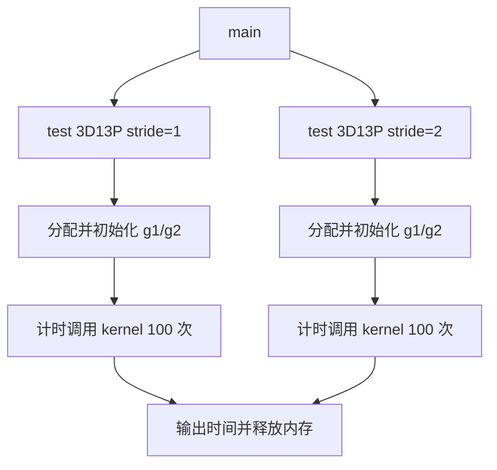
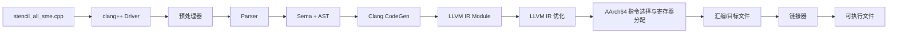
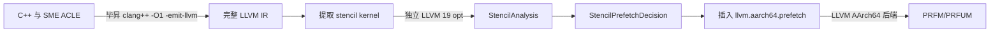

# SME 测试用例执行与编译流程

## 1. 3D13P SME 测试用例执行流程

### 1.1 总体说明执行流程

本目录的 `stencil_all_sme.cpp` 是从服务器抄写的 3D 13-point stencil 测试片段，
由三个部分组成：

1. `main`：选择要执行的测试场景。
2. `test_stencil_3d_13point`：分配数据、初始化输入、计时并重复调用 kernel。
3. `stencil3D_13point_sme`：使用 SVE 加载 13 个邻域向量，通过 SME ZA 完成累加和
   平均值计算。



测试规模固定为 `128 x 512 x 512`。`g1` 和 `g2` 各包含 33,554,432 个
`double`，每个约 256 MiB，合计约 512 MiB。内存分配和输入初始化不在计时范围内；
`Time:` 表示 100 次 kernel sweep 的墙钟总时间，单次平均时间需要除以 100。

100 次调用始终读取 `g1` 并覆盖 `g2`，两个数组不会交换。因此该测试不是 100 个
相互依赖的时间步，而是对同一个输入重复执行相同计算。当前片段也没有 reference
kernel 或结果比较，只能测量运行时间，不能独立验证计算正确性。

kernel 的执行顺序为：

```text
获取 streaming VL
  -> 遍历内部 k/i/j
  -> 生成 j 方向尾部谓词
  -> 加载中心和 12 个邻域向量
  -> 清空 ZA
  -> 执行 13 次 MOPA 累加
  -> 从 ZA 读出结果
  -> 乘以 1/13
  -> 写入 new_grid
```

`stride=2` 只让 `k/i` 跳过平面或行，并让 `j` 跳过一个完整向量块。单次
`svld1_f64` 仍然加载连续元素，不是 lane 内步长为 2 的 gather。

### 1.2 以代码块形式逐语句说明

以下代码块保持原文件的语句和顺序，并用 `//` 注释解释。注释不属于服务器原代码。
其中明显的抄写错误不会直接修正，而是在对应位置标出。

#### 1.2.1 头文件和 Kernel 声明

```cpp
// 引入 SME ZA tile、MOPA 和 ZA 读写相关 ACLE 声明。
#include <arm_sme.h>

// 引入 SVE 向量类型、谓词、加载、存储和向量运算声明。
#include <arm_sve.h>

// 提供 high_resolution_clock 和 duration。
#include <chrono>

// 提供 std::cout 和 std::endl。
#include <iostream>

// 提供 aligned_alloc 和 free。
#include <cstdlib>

// 提供 C 字符串接口；当前片段没有实际使用。
#include <cstring>

// 请求函数进入时使用新的 ZA 状态。
__arm_new("za")

// 声明输入网格、输出网格、三维尺寸和 stride。
// __restrict__ 表示 grid 与 new_grid 不发生别名。
void stencil3D_13point_sme(
    double* __restrict__ grid,
    double* __restrict__ new_grid,
    int depth, int rows, int cols, int stride)

// 声明函数在 SME streaming mode 中运行并开始函数体。
__arm_streaming {
```

#### 1.2.2 Kernel 初始化和循环控制

```cpp
    // 返回当前 streaming vector length 能容纳的 double lane 数。
    // 例如 streaming VL=512 bit 时，SVL=512/64=8。
    uint64_t SVL = svcntd();

    // 一个 k 平面包含 rows*cols 个 double，用于三维下标线性化。
    int plane_size = rows * cols;

    // 创建所有 lane 都为 1/13 的向量，最后用于计算平均值。
    svfloat64_t weight_vec = svdup_f64(1.0 / 13.0);

    // 创建全 1 向量，作为每次 ZA 外积的纵向操作数。
    svfloat64_t ones = svdup_f64(1.0);

    // 创建所有 64-bit lane 都有效的谓词，控制 ZA 纵向维度。
    svbool_t pg_all = svptrue_b64();

    // 从 k=1 开始，避开第 0 个平面和最后一个平面。
    // stride=2 时每次跳过一个平面。
    for (int k = 1; k < depth - 1; k += stride) {

        // 从 i=1 开始，避开第 0 行和最后一行。
        // stride=2 时每次跳过一行。
        for (int i = 1; i < rows - 1; i += stride) {

            // j 沿连续维按向量块前进。
            // stride=2 时跳过一个完整向量块，不是隔元素加载。
            for (int j = 1; j < cols - 1; j += SVL * stride) {

                // 计算当前迭代采用的 j 上界。
                // stride=2 时该范围可大于一个向量，但谓词最多仍有 SVL 个 lane。
                int j_limit = (cols - 1 < j + SVL * stride - 1)
                                  ? cols - 1
                                  : j + SVL * stride - 1;

                // 为当前 j 向量块生成一个 64-bit lane 谓词。
                // 第 n 个 lane 对应列 j+n；仅当 j+n < j_limit+1 时置为 true。
                // 因此完整向量块得到全 true，尾部不足 SVL 个元素时只打开前几个 lane。
                svbool_t pg = svwhilelt_b64(j, j_limit + 1);

                // 若谓词中没有有效 lane，则结束 j 循环。
                if (!svptest_any(svptrue_b64(), pg))
                    break;

                // 把当前坐标 (k,i,j) 转换为一维数组起始下标。
                int base_idx = k * plane_size + i * cols + j;
```

`svwhilelt_b64(start, end)` 可以理解为按下面的规则生成谓词，其中 lane 数由运行时
streaming vector length 决定：

```text
pg[n] = (start + n < end),  0 <= n < SVL

这里：
start = j
end   = j_limit + 1
所以：pg[n] = (j + n <= j_limit)
```

例如 `SVL=8`，当前 `j=17`：

| `j_limit` | `pg` 的 8 个 lane | 实际处理的列 |
|---|---|---|
| 24 | `T T T T T T T T` | 17 到 24，共 8 列 |
| 21 | `T T T T T F F F` | 17 到 21，共 5 列 |
| 16 | `F F F F F F F F` | 没有可处理列，`svptest_any` 为 false |

这个 `pg` 会贯穿当前 `j` 迭代：

1. `svld1_f64(pg, address)` 只读取 true lane 对应的连续地址，false lane 不访问内存；
2. `svmopa_za64_f64_m(..., pg_all, pg, ...)` 用 `pg` 限制 ZA 外积的列方向；
3. `svmul_f64_z(pg, ...)` 只计算有效 lane，并把无效 lane 置零；
4. `svst1_f64(pg, address, result)` 只写回有效 lane。

因此 `pg` 的主要作用是让同一套向量指令既能处理完整向量块，也能安全处理不足
`SVL` 个元素的尾块。它不决定向量寄存器的物理长度，只决定本次操作中哪些 lane
参与计算和访存。

还要注意，`stride=2` 时 `pg` **不会**变成 `T F T F ...`，也不会执行 gather。
当前代码仍连续处理最多 `SVL` 列，只是下一轮 `j += 2*SVL`，从而跳过中间的一个
完整向量块。

这里需要注意尾部边界：`j_limit` 最多取 `cols-1`，随后谓词使用
`j_limit+1`，因此可能允许输出列 `cols-1`。对于需要访问 `j+1` 的邻域，最末 lane
还可能跨到下一行。分析预取前应与服务器原代码核对这里是否应限制到 `cols-2`。

#### 1.2.3 加载 13 个输入向量

```cpp
                // (0,0,0)：加载中心向量。
                svfloat64_t center =
                    svld1_f64(pg, &grid[base_idx]);

                // (-1,0,0)：前一个平面的同位置向量。
                svfloat64_t k1_i0_j0 =
                    svld1_f64(pg, &grid[(k - 1) * plane_size + i * cols + j]);

                // (+1,0,0)：后一个平面的同位置向量。
                svfloat64_t kp1_i0_j0 =
                    svld1_f64(pg, &grid[(k + 1) * plane_size + i * cols + j]);

                // (0,-1,0)：当前平面的上一行。
                svfloat64_t k0_i1_j0 =
                    svld1_f64(pg, &grid[k * plane_size + (i - 1) * cols + j]);

                // (0,+1,0)：当前平面的下一行。
                svfloat64_t k0_ip1_j0 =
                    svld1_f64(pg, &grid[k * plane_size + (i + 1) * cols + j]);

                // (0,0,-1)：从中心左侧一个元素开始连续加载。
                svfloat64_t k0_i0_j1 =
                    svld1_f64(pg, &grid[k * plane_size + i * cols + (j - 1)]);

                // (0,0,+1)：从中心右侧一个元素开始连续加载。
                svfloat64_t k0_i0_jp1 =
                    svld1_f64(pg, &grid[k * plane_size + i * cols + (j + 1)]);

                // (-1,-1,0)：前一平面的上一行。
                svfloat64_t k1_i1_j0 = svld1_f64(
                    pg, &grid[(k - 1) * plane_size + (i - 1) * cols + j]);

                // (-1,+1,0)：前一平面的下一行。
                svfloat64_t k1_ip1_j0 = svld1_f64(
                    pg, &grid[(k - 1) * plane_size + (i + 1) * cols + j]);

                // (+1,-1,0)：后一平面的上一行。
                svfloat64_t kp1_i1_j0 = svld1_f64(
                    pg, &grid[(k + 1) * plane_size + (i - 1) * cols + j]);

                // (+1,+1,0)：后一平面的下一行。
                svfloat64_t kp1_ip1_j0 = svld1_f64(
                    pg, &grid[(k + 1) * plane_size + (i + 1) * cols + j]);

                // (-1,0,-1)：前一平面中从 j-1 开始的向量。
                svfloat64_t k1_i0_j1 = svld1_f64(
                    pg, &grid[(k - 1) * plane_size + i * cols + (j - 1)]);

                // (+1,0,+1)：后一平面中从 j+1 开始的向量。
                svfloat64_t kp1_i0_jp1 = svld1_f64(
                    pg, &grid[(k + 1) * plane_size + i * cols + (j + 1)]);
```

`svld1_f64(pg, address)` 的第 `n` 个有效 lane 加载 `address[n]`。逻辑加载量为
`有效 lane 数 x 8 byte`；无效 lane 不访问内存。处理完整向量时，一条加载最多读取
`SVL x 8 byte`，但硬件 cache 传输仍以 cache line 为基本粒度。

#### 1.2.4 ZA 累加、缩放和写回

```cpp
                // 每个输出向量开始前清空 ZA，避免保留上一次 j 迭代的结果。
                svzero_za();

                // 第 1 项：累加中心向量。
                svmopa_za64_f64_m(0, pg_all, pg, ones, center);

                // 第 2 项：累加 (-1,0,0)。
                svmopa_za64_f64_m(0, pg_all, pg, ones, k1_i0_j0);

                // 第 3 项：累加 (+1,0,0)。
                svmopa_za64_f64_m(0, pg_all, pg, ones, kp1_i0_j0);

                // 第 4 项：累加 (0,-1,0)。
                svmopa_za64_f64_m(0, pg_all, pg, ones, k0_i1_j0);

                // 第 5 项：累加 (0,+1,0)。
                svmopa_za64_f64_m(0, pg_all, pg, ones, k0_ip1_j0);

                // 第 6 项：累加 (0,0,-1)。
                svmopa_za64_f64_m(0, pg_all, pg, ones, k0_i0_j1);

                // 第 7 项：累加 (0,0,+1)。
                svmopa_za64_f64_m(0, pg_all, pg, ones, k0_i0_jp1);

                // 第 8 项：累加 (-1,-1,0)。
                svmopa_za64_f64_m(0, pg_all, pg, ones, k1_i1_j0);

                // 第 9 项：累加 (-1,+1,0)。
                svmopa_za64_f64_m(0, pg_all, pg, ones, k1_ip1_j0);

                // 第 10 项：累加 (+1,-1,0)。
                svmopa_za64_f64_m(0, pg_all, pg, ones, kp1_i1_j0);

                // 第 11 项：累加 (+1,+1,0)。
                svmopa_za64_f64_m(0, pg_all, pg, ones, kp1_ip1_j0);

                // 第 12 项：累加 (-1,0,-1)。
                svmopa_za64_f64_m(0, pg_all, pg, ones, k1_i0_j1);

                // 第 13 项：累加 (+1,0,+1)。
                svmopa_za64_f64_m(0, pg_all, pg, ones, kp1_i0_jp1);

                // 从 ZA tile 0 的第 0 行读出逐 lane 累加结果。
                svfloat64_t sum =
                    svread_hor_za64_m(svundef_f64(), pg_all, 0, 0);

                // 有效 lane 乘以 1/13，无效 lane 清零。
                svfloat64_t result = svmul_f64_z(pg, sum, weight_vec);

                // 在 pg 控制下把有效 lane 写回 new_grid[base_idx]。
                svst1_f64(pg, &new_grid[base_idx], result);
            }
        }
    }
}
```

#### 1.2.5 测试函数

```cpp
// run_stride1/run_stride2 分别决定是否执行两个场景。
// 返回值是本次调用实际执行场景的耗时之和。
double test_stencil_3d_13point(bool run_stride1, bool run_stride2) {

    // 输出算子标题，不属于 kernel 计时范围。
    std::cout << std::endl << "------3d13p-----" << std::endl;

    // 固定测试规模为 128x512x512。
    const int DEPTH = 128, ROWS = 512, COLS = 512;

    // 分配约 256 MiB、64-byte 对齐的输入网格。
    double* g1 = (double*)aligned_alloc(
        64, DEPTH * ROWS * COLS * sizeof(double));

    // 分配约 256 MiB、64-byte 对齐的输出网格。
    double* g2 = (double*)aligned_alloc(
        64, DEPTH * ROWS * COLS * sizeof(double));

    // 初始化两个可选场景的累计耗时。
    double total_time = 0.0;

    // 保存单个场景的耗时。
    double elapsed;

    // 只有调用者请求 stride=1 时才执行第一段测试。
    if (run_stride1) {

        // 在计时前初始化 g1[k,i,j] = 1 + linear_index。
        // g2 没有初始化。
        for (int k = 0; k < DEPTH; k++)
            for (int i = 0; i < ROWS; i++)
                for (int j = 0; j < COLS; j++)
                    g1[k * ROWS * COLS + i * COLS + j] =
                        1.0 + (k * ROWS + i) * COLS + j;

        // 标记即将执行 stride=1。
        std::cout << "stride=1..." << std::endl;

        // 记录计时起点。
        auto start = std::chrono::high_resolution_clock::now();

        // 连续调用 100 次；每次读取相同 g1 并覆盖 g2。
        for (int iter = 0; iter < 100; iter++)
            stencil3D_13point_sme(g1, g2, DEPTH, ROWS, COLS, 1);

        // 记录计时终点。
        auto end = std::chrono::high_resolution_clock::now();

        // 计算 100 次调用的墙钟总秒数。
        elapsed = std::chrono::duration<double>(end - start).count();

        // 输出 stride=1 时间。
        std::cout << "Time:" << elapsed << std::endl;

        // 加入测试函数的总时间。
        total_time += elapsed;
    }

    // 只有调用者请求 stride=2 时才执行第二段测试。
    if (run_stride2) {

        // 在 stride=2 计时前重新写入与 stride=1 相同的输入。
        for (int k = 0; k < DEPTH; k++)
            for (int i = 0; i < ROWS; i++)
                for (int j = 0; j < COLS; j++)
                    g1[k * ROWS * COLS + i * COLS + j] =
                        1.0 + (k * ROWS + i) * COLS + j;

        // 标记即将执行 stride=2。
        std::cout << "stride=2..." << std::endl;

        // 记录计时起点。
        auto start = std::chrono::high_resolution_clock::now();

        // 连续调用 100 次 stride=2 kernel。
        for (int iter = 0; iter < 100; iter++)
            stencil3D_13point_sme(g1, g2, DEPTH, ROWS, COLS, 2);

        // 记录计时终点。
        auto end = std::chrono::high_resolution_clock::now();

        // 计算 stride=2 的 100 次调用总秒数。
        elapsed = std::chrono::duration<double>(end - start).count();

        // 输出 stride=2 时间。
        std::cout << "Time:" << elapsed << std::endl;

        // 加入测试函数的总时间。
        total_time += elapsed;
    }

    // 释放输入和输出网格。
    free(g1);
    free(g2);

    // 返回本次函数实际执行场景的耗时之和。
    return total_time;
}
```

当前代码没有检查 `aligned_alloc` 是否失败，也没有初始化或校验输出边界。

#### 1.2.6 `main` 入口

```cpp
// 程序入口保留 argc/argv，但当前片段没有读取命令行参数。
int main(int argc, char* argv[]) {

    // 服务器原程序会根据参数选择 stencil 用例；具体逻辑已被省略。
    // ...根据参数判断执行哪些stencil用例

    // 分配一套网格，只执行 stride=1；返回的耗时没有保存。
    test_stencil_3d_13point(true, false);

    // 再分配一套网格，只执行 stride=2；返回的耗时没有保存。
    test_stencil_3d_13point(false, true);

    // 服务器原程序还会累计并输出总时间；当前片段已省略。
    // ...记录并输出总运行时间

    // 到达 main 末尾等价于 return 0。
}
```

在分析 LLVM IR 或评估预取效果前，仍应核对第 23 行 `svptrue_b64` 是否应为
`svptrue_b64()`，并确认 `j_limit` 是否应将右边界限制到 `cols-2`。否则编译
错误或越界访问可能被误判为 Pass 或预取模型问题。

## 2. 毕昇编译器从 C++ 到 LLVM IR 的过程

### 2.1 毕昇与 LLVM/Clang 的关系

毕昇编译器以 LLVM/Clang 为基础，因此 `clang++` 编译这个 `.cpp` 文件时，主干
流程仍是 Clang Driver 调度 Clang 前端，再由 Clang CodeGen 生成 LLVM IR。毕昇
在此基础上提供面向鲲鹏/AArch64 的目标支持、优化和运行时适配。查阅源码时需要
区分以下两类仓库：

- [openEuler 毕昇编译器仓库](https://gitee.com/openeuler/bisheng-compiler)：毕昇项目源码与说明入口。
- [src-openEuler 毕昇软件包仓库](https://gitee.com/src-openeuler/bisheng-compiler)：发行包的 spec、补丁和构建材料；它不等同于完整 LLVM 源码树。
- [LLVM monorepo](https://github.com/llvm/llvm-project)：Clang 前端、LLVM IR 优化器和 AArch64 后端的上游实现。

毕昇 Enterprise 5.x 的具体补丁和目录可能与上游同版本 LLVM 不完全一致，但下文
描述的前端阶段及主要源码入口是一致的。服务器上应以
`$BISHENG_CXX --version`、`$BISHENG_CXX -print-resource-dir` 和实际发行包源码为准。

### 2.2 总体编译流水线



`clang++` 是编译驱动，不亲自完成所有转换。它分析命令行，确定目标架构、头文件
路径、优化等级和链接选项，然后生成前端、汇编器和链接器任务。可用
`$BISHENG_CXX -### stencil_all_sme.cpp` 只打印这些任务而不执行。

如果命令带 `-S -emit-llvm`，流水线在 LLVM IR 处停止并输出 `.ll`。`.ll` 不是
另一种 IR 层级，而是 LLVM IR 的文本表示；对应的二进制表示是 `.bc`。

### 2.3 各阶段做了什么

| 阶段 | 主要工作 | 输出或观察命令 | 上游源码入口 |
|---|---|---|---|
| Driver | 解析 `-target`、`-march`、`-O1` 等参数，组装编译任务 | `clang++ -###` | [`clang/tools/driver/driver.cpp`](https://github.com/llvm/llvm-project/blob/main/clang/tools/driver/driver.cpp)、[`clang/lib/Driver/Driver.cpp`](https://github.com/llvm/llvm-project/blob/main/clang/lib/Driver/Driver.cpp) |
| 预处理 | 展开 `#include`、宏和条件编译；找到毕昇资源目录中的 `arm_sve.h`、`arm_sme.h` | `clang++ -E` | [`clang/lib/Lex`](https://github.com/llvm/llvm-project/tree/main/clang/lib/Lex) |
| Parser | 将 token 解析为声明、表达式、循环和属性等语法结构 | 与 AST 一起观察 | [`clang/lib/Parse`](https://github.com/llvm/llvm-project/tree/main/clang/lib/Parse) |
| Sema/AST | 类型检查、重载解析、名称绑定，并验证 SME 属性与 ACLE 内建函数是否满足目标特性 | `-Xclang -ast-dump -fsyntax-only` | [`clang/lib/Sema`](https://github.com/llvm/llvm-project/tree/main/clang/lib/Sema)、[Clang AST 说明](https://clang.llvm.org/docs/IntroductionToTheClangAST.html) |
| CodeGen | 遍历 AST，把函数、循环、内存访问和目标内建函数转换为 LLVM IR | `-S -emit-llvm` | [`clang/lib/CodeGen/CodeGenAction.cpp`](https://github.com/llvm/llvm-project/blob/main/clang/lib/CodeGen/CodeGenAction.cpp)、[`CodeGenFunction.cpp`](https://github.com/llvm/llvm-project/blob/main/clang/lib/CodeGen/CodeGenFunction.cpp) |
| IR 优化 | 按 `-O0/-O1/-O2/-O3` 构造 Pass pipeline，执行内联、循环和标量优化等 | `-Rpass` 或 `-mllvm -debug-pass-manager`（是否可用取决于发行版） | [`clang/lib/CodeGen/BackendUtil.cpp`](https://github.com/llvm/llvm-project/blob/main/clang/lib/CodeGen/BackendUtil.cpp)、[`llvm/lib/Passes/PassBuilder.cpp`](https://github.com/llvm/llvm-project/blob/main/llvm/lib/Passes/PassBuilder.cpp) |
| AArch64 后端 | IR 指令选择、合法化、寄存器分配、调度和 MC 编码 | `-S` 生成 `.s`，`-c` 生成 `.o` | [`llvm/lib/Target/AArch64`](https://github.com/llvm/llvm-project/tree/main/llvm/lib/Target/AArch64)、[LLVM Code Generator](https://llvm.org/docs/CodeGenerator.html) |
| 链接 | 合并目标文件和 C/C++、SME ABI 等运行时，生成可执行文件 | 不加 `-S` 或 `-c` | 驱动选择的系统链接器或 LLD |

其中从驱动进入前端的关键调用链可以概括为：

```text
clang++ main
  -> Driver::BuildCompilation
  -> 执行 clang -cc1 前端任务
  -> ExecuteCompilerInvocation
  -> CompilerInstance::ExecuteAction
  -> Parser + Sema 构造 AST
  -> CodeGenAction / CodeGenerator 构造 llvm::Module
  -> EmitBackendOutput 运行 LLVM Pass pipeline 并输出 IR/汇编/目标文件
```

这是便于定位源码的逻辑调用链；不同 LLVM/毕昇版本中的辅助函数和内部调用层次可能
发生变化。

### 2.4 当前 SME kernel 如何转换

#### 2.4.1 头文件与函数属性

`arm_sve.h` 和 `arm_sme.h` 位于编译器资源目录中。它们主要提供 ACLE 类型、属性、
重载入口和内建函数映射，不包含一个像普通 `.cpp` 库那样的循环实现。因此
`svld1_f64`、`svmopa_za64_f64_m` 等调用通常不会编译成对同名外部函数的调用。

`__arm_streaming` 和 `__arm_new("za")` 先作为 Clang 能理解的函数属性进入 AST，
随后转换为 LLVM IR 中的 AArch64/SME 函数属性及状态约束。编译器还会检查
`-march` 是否包含这些操作要求的特性，例如 `sme-f64f64`。

#### 2.4.2 SVE/SME 操作

以 kernel 中的语句为例：

```text
svwhilelt_b64(...)       -> 构造可伸缩向量谓词
svld1_f64(pg, ptr)       -> 带谓词的 SVE 向量加载
svmopa_za64_f64_m(...)   -> SME ZA 外积累加语义
svread_hor_za64_m(...)   -> 从 ZA 水平切片读取向量
svst1_f64(pg, ptr, vec)  -> 带谓词的 SVE 向量存储
```

CodeGen 会把这些目标相关操作降为 `llvm.aarch64.sve.*` 或
`llvm.aarch64.sme.*` 一类 LLVM intrinsic，普通地址计算则表现为 `getelementptr`
（GEP），循环表现为基本块、`phi` 和条件分支。intrinsic 的确切名称和参数随 LLVM
版本变化，应以服务器生成的 `.ll` 为准。

### 2.5 本项目预取 Pass 在流水线中的位置

本项目没有在 C++ AST 或 Clang CodeGen 中插入预取，而是在已经生成的 LLVM IR
上运行独立的 new-PM 插件：



具体对应关系如下：

1. `01_llvm_ir_analysis/generate_and_check.sh` 调用毕昇 `clang++`，使用
   `-O1 -fno-inline -S -emit-llvm` 生成完整 `.ll`，再从包含 `test` 和 `main` 的
   Module 中提取 stencil kernel。
2. `02_llvm_pass_plugin/build_and_test.sh` 使用独立 LLVM 19 构建并加载
   `StencilPrefetchPass`。
3. `StencilAnalysis` 从 GEP、load、循环、SCEV 和可伸缩向量步长中恢复数据流；
   `StencilPrefetchDecision` 立即作出距离、层级和 KEEP/STRM 决策。
4. 同一个 Pass 在循环中插入 `llvm.aarch64.prefetch`，然后 `verify` 检查 IR。
5. AArch64 后端把 intrinsic 选择为目标预取指令。当前脚本还会核对 IR 中 intrinsic
   数量与汇编中的 `PRFM`/`PRFUM` 数量。

因此我们的 Pass 位于 **Clang 前端和初始 `-O1` IR 优化之后、AArch64 指令选择
之前**。它能看到规范化后的 SSA、GEP、循环和 SCEV，但已经失去一部分 C++ 层的
数组形状、源码变量名和 stencil 邻域表达式语义，这也是当前分析必须从 IR 拓扑
恢复物理流的原因。

### 2.6 在服务器观察每一步

以下命令只观察编译过程，不需要修改源码。`BISHENG_CXX` 应指向能直接编译原 SME
程序的毕昇 `clang++`：

```bash
# 1. 查看版本、资源头文件目录和 Driver 将执行的子任务。
"$BISHENG_CXX" --version
"$BISHENG_CXX" -print-resource-dir
"$BISHENG_CXX" -### -march=armv9-a+sme+sme-f64f64 stencil_all_sme.cpp

# 2. 查看预处理结果。
"$BISHENG_CXX" -E -march=armv9-a+sme+sme-f64f64 \
  stencil_all_sme.cpp -o stencil_all_sme.ii

# 3. 查看 Clang AST；输出很大，重定向到文件。
"$BISHENG_CXX" -march=armv9-a+sme+sme-f64f64 -fsyntax-only \
  -Xclang -ast-dump stencil_all_sme.cpp > stencil_all_sme.ast.txt

# 4. 生成 LLVM IR。项目步骤 1 使用 -O1 和 -fno-inline。
"$BISHENG_CXX" -O1 -fno-inline -S -emit-llvm \
  -march=armv9-a+sme+sme-f64f64 stencil_all_sme.cpp -o stencil_all_sme.ll

# 5. 不经过汇编和链接，直接查看 AArch64 汇编。
"$BISHENG_CXX" -O1 -S -march=armv9-a+sme+sme-f64f64 \
  stencil_all_sme.cpp -o stencil_all_sme.s
```

本项目的真实服务器流程不能简单地把所有步骤都换成独立 LLVM 的 `clang++`：原始
C++ 应先由毕昇前端处理 SME ACLE 与 ABI；独立 LLVM 19 负责读取兼容的 LLVM IR、
运行自定义 `opt` Pass。生成最终可执行文件时仍需使用能正确提供毕昇 SME ABI
运行时和链接参数的毕昇驱动。

## 3. SMEStencil 论文逐章分析

### 3.1 论文信息与整体结构

本节分析本地论文
论文/SMEStencil_Optimizing_High-Order_Stencils_on_ARM_Multicore_Using_SME_Unit.pdf：

- 题目：*SMEStencil: Optimizing High-Order Stencils on ARM Multicore Using SME Unit*。
- 作者：Yinuo Wang、Tianqi Mao、Lin Gan 等。
- 期刊：IEEE Transactions on Parallel and Distributed Systems，Vol. 37，No. 3，
  2026 年 3 月。
- DOI：[10.1109/TPDS.2025.3650515](https://doi.org/10.1109/TPDS.2025.3650515)。

论文按照“提出问题、介绍背景、确认性能缺口、设计方案、扩展并行、实验验证、总结”
的顺序展开：

| 论文章节 | 主要作用 |
|---|---|
| I. Introduction | 说明高阶 3D stencil 的重要性、已有工作的不足和论文贡献 |
| II. Background | 介绍高阶 stencil、真实 RTM 需求、SME 和目标 ARM 多核 SoC |
| III. Related Work and Motivation | 回顾 CPU/GPU/矩阵单元方案，并用实验确认高阶 stencil 的性能缺口 |
| IV. Design of SMEStencil | 给出 stencil 到 SME 的映射、性能模型、微架构和内存优化 |
| V. Parallel Optimizations | 处理多线程私有缓存共享和跨 NUMA 通信 |
| VI. Experiments | 验证各项优化、整体性能、扩展性和 RTM 应用收益 |
| VII. Conclusion | 总结结论、适用边界和未来方向 |

论文研究的是 ARMv9-A 多核 CPU 上利用 SME 加速高阶 stencil 的全栈方案，不是
编译器自动识别 stencil 或自动插入软件预取的论文。

### 3.2 第一章：Introduction

#### 3.2.1 本章提出的问题

第一章先说明 stencil 是有限差分、有限体积等 PDE 离散方法中的基础计算模式，广泛
用于天气、流体和地震模拟。高阶 3D stencil 尤其重要，因为更大的半径可以用更少
网格点达到所需数值精度，从而降低 RTM 等应用的存储规模。

但高阶 stencil 也带来新的性能困难：

- 邻域点数增加，传统 SIMD 的计算指令和调度压力增大；
- 半径扩大后，halo、工作集和跨平面访问增加，数据复用更困难；
- stencil 通常受内存限制，单纯增加矩阵计算吞吐率未必带来整体加速；
- 真实 HPC 应用会组合多种 stencil 和中间结果，单个 kernel 的加速不一定能转化为
  应用加速。

#### 3.2.2 本章指出的研究空白

已有 Tensor Core 方案主要研究 2D star/box stencil，且后续复现实验表明它们未必
优于优化良好的 CUDA Core 实现。已有工作也很少同时处理以下三点：

1. 3D 高阶 stencil；
2. ARM SME 外积矩阵单元；
3. 从 kernel 到多核、NUMA 和真实 RTM 的端到端优化。

第一章据此提出论文的核心研究问题：如何让 SME 在不同维度、形状和半径的 stencil
上保持高利用率，并把 kernel 收益扩展到真实 HPC 应用。

#### 3.2.3 本章列出的贡献

论文把贡献概括为三个层次：

1. kernel 层：提出 SME 外积映射和四项 SME/SVE 微架构优化；
2. 内存与并行层：提出数据重排、gather 软件预取、cache-snoop 线程共享、SDMA
   NUMA 通信和流水重叠；
3. 应用层：给出把基本 stencil 算子集成到 VTI/TTI RTM 的方法，并验证端到端收益。

本章的作用是定义研究范围。后续第二章解释所需硬件和应用背景，第三章用实验确认
性能缺口，第四、第五章分别解决单核和并行问题。

### 3.3 第二章：Background

第二章分为 High-Order Stencil 和 Scalable Matrix Extension and ARM Multicore
SoC 两部分。

#### 3.3.1 High-Order Stencil

本节解释为什么真实应用需要高阶 stencil。有限差分求导使用邻域网格点近似导数，
增加半径通常可以提高空间精度。论文以波传播为例说明，高阶 stencil 可以减少每个
波长所需网格点数，从而显著缩小三维问题规模；半径 4 是 RTM 中常见的选择。

本节还用 VTI 和 TTI 介质中的 RTM 方程说明，真实应用并不是只执行一个规则 star
stencil：

- VTI 会耦合水平和垂直应力变量；
- TTI 包含三个纯二阶偏导和三个混合二阶偏导；
- 一个最终输出可能依赖多个前序 stencil 的中间结果；
- stencil 结果还要与空间变化的介质参数进行标量运算。

因此论文的目标不只是优化独立 benchmark，还要支持多算子组合和中间结果复用。

#### 3.3.2 SME 与目标 ARM 多核 SoC

本节介绍 SME 的外积计算方式。每次操作从两个 SVE 向量形成外积，并累加到 ZA
矩阵 tile。以 512-bit 向量、单精度为例，ZA 可划分为多个 16 x 16 tile；高性能
执行需要在多个 tile 之间交错外积，以隐藏指令延迟。

论文还介绍实验 SoC 的关键特征：

- 每个核心具有 SVE、SME 和私有数据缓存；
- 一个 NUMA 域内有大量核心，但没有传统共享 LLC；
- 多个 NUMA 域使用片上高带宽内存和容量更大的 DDR；
- 片上内存可作为 cache 或独立地址空间；
- SoC 提供 SDMA 引擎，可在 DDR、片上内存和 NUMA 域间搬运数据。

这些硬件特征直接决定后续方案：私有缓存促使第五章使用 cache snoop，宽片上内存
促使第四章减少访问流并显式预取，SDMA 则用于跨 NUMA halo 交换。

### 3.4 第三章：Related Work and Motivation

第三章先回顾已有 stencil 优化，再通过对比实验确认论文要解决的性能缺口。

#### 3.4.1 CPU、GPU 与 Tensor Core 相关工作

CPU 工作主要采用向量化、公共子表达式消除、寄存器/cache 复用、数据布局变换和
代码生成。BrickLib 的 brick 布局为论文的数据重排方案提供了基础。

GPU 工作主要使用空间/时间 blocking、shared memory 和寄存器复用，也有 Physis、
Lift、Artemis、AN5D 等 DSL。论文指出，真实应用的复杂边界条件会限制 temporal
blocking 深度，因此实验统一使用单时间步。

矩阵单元工作包括 TCStencil、ConvStencil 和 LoRAStencil。它们分别采用矩阵映射、
卷积/Im2Col 或低秩分解，但主要面向 2D stencil，没有解决 3D 高阶 stencil 和真实
应用集成问题。

#### 3.4.2 Motivation Experiments

论文比较 CPU 编译器版本、手写 SIMD，以及 GPU 上的 Tensor Core 和 CUDA Core
方案，并用有效带宽利用率统一衡量不同平台。

实验得到两个关键结论：

- 2D star 和低阶 3D stencil 上，编译器或手写 SIMD 已有很高利用率，优化空间有限；
- 随 3D stencil 半径增大，CPU 和 GPU 方案的带宽效率都会明显下降，box stencil
  的下降更严重。

因此论文没有假设 SME 对所有 stencil 都更快，而是把研究重点放到现有方案退化最
明显的 3D 高阶 stencil。第三章给第四章的设计提供了实验动机。

### 3.5 第四章：Design of SMEStencil

第四章是论文的核心，依次介绍外积映射、初步性能模型、四项微架构优化、两项内存
优化和真实应用集成。

#### 3.5.1 Mapping Stencil to the SME Unit

论文先把一维 stencil 映射到 SME 外积。设输出 tile 为 (Vx, Vy)，半径为 r：

- y 方向从带左右 halo 的输入块逐行加载向量；
- 另一个外积操作数是由 stencil 系数和零元素构成的列向量；
- 外积把输入向量按系数广播到相应输出行并累加到 ZA；
- x 方向采用对称的列映射；
- z 方向把最外层维度按类似方式处理；
- 3D stencil 通过组合 x、y、z 三个一维映射实现。

这种方法不是先构造完整通用矩阵再调用矩阵乘法，而是直接利用 SME 外积对 ZA 多行
或多列进行广播累加。

#### 3.5.2 A Preliminary Performance Model

论文比较计算一个 (VL, VL) 输出块时 SIMD 与 SME 的理论周期：

    Cycles_SIMD = VL * (2r + 1) * CPI_SIMD
    Cycles_SME  = (VL + 2r) * CPI_SME

    FLOPS_SMEStencil
      = [VL * (2r + 1) * CPI_SIMD / ((VL + 2r) * CPI_SME)]
        * FLOPS_SIMD

其中 VL 是 SIMD 向量长度，r 是半径，两个 CPI 分别表示 SIMD FMA 和 SME 外积的
每指令周期。SIMD 工作量随 VL * (2r+1) 增长，而 SME 外积数只随 VL+2r 增长，
所以半径越大，SME 越容易表现出计算优势。

该模型只估计计算指令，没有包含 load/store、转置、cache miss 和中间结果成本。
论文随后用微架构优化处理这些额外开销，并在第六章通过实验验证。

#### 3.5.3 Microarchitectural Optimizations

本节提出四项优化：

1. Tile-Based ILP：把不同层的计算分配给多个 ZA tile，交错发出无数据依赖的
   外积，让乱序执行器隐藏延迟。
2. Tile-Assisted Vector Transpose：x 方向需要列向量。论文使用 ZA 的水平
   load 和垂直 store 完成转置，替代大量 SVE permutation。
3. Cache Pollution Avoiding Intermediate Result Placement：x/y 与 z 方向的
   tile 形状不一致，部分结果必须写回再加载。论文写入临时缓冲区而不是最终输出，
   减少额外 cache 读写和污染。
4. Redundant-Access Zeroing Box Stencil：多个一维 stencil 共享相邻 cache line。
   论文调整循环顺序，并用 SVE splice 提取各外积需要的数据，减少 box stencil 的
   重复加载和非对齐访问。

这四项优化分别解决外积延迟、x 方向跨步访问、方向切换的中间结果，以及 box
stencil 的冗余访问。

#### 3.5.4 Memory Optimizations

SME 提高计算吞吐后，瓶颈重新转向数据供给。本节包含两项相互依赖的优化。

第一项是 SIMD-Friendly Memory Reorder。Tile-Based ILP 会产生大量离散访问流。
论文以单精度 3DStarR4 为例，原方案可能形成 226 条访问流。为此借鉴 BrickLib，
把规则网格重排为 (Bx, By, Bz) brick，使 tile 访问更少、更连续的物理流。论文
实验配置取 Bx=VL、By=Bz=4；这些值与目标向量长度、最大半径和 tile 整除关系
有关，不是通用常量。

第二项是 Gather-Based Software Prefetch。论文没有为每条普通加载分别发出 64 B
预取，而是在 SVE lane 中放置多个 cache line 头地址，一条 gather-prefetch 同时
预取 VL 条 cache line。配合 brick 布局，单精度情况下可用一次指令覆盖一个 brick，
以较低指令开销重叠 SME 计算和内存访问。

这说明论文的软件预取建立在 brick 重排之后，候选单位是一个 brick 的 cache line
集合，而不是原始线性布局中的单条 load。

#### 3.5.5 Integrating SMEStencil Into HPC Applications

本节把小块一维 stencil 封装为基本算子，再组合成 TTI RTM 所需的纯二阶和混合
二阶偏导：

- 先计算一阶导数并保存在线程私有临时缓冲区；
- 利用混合偏导的交换性选择更合适的计算顺序；
- 必要时转置中间结果，再执行另一方向的一维 stencil；
- 最后用 SVE 运算组合偏导和介质参数。

只要临时缓冲区能保留在私有 cache 中，后续算子就能复用中间结果，避免不必要的
主存流量。本节把第四章的 kernel 方案连接到论文的真实应用目标。

### 3.6 第五章：Parallel Optimizations

第五章解决单核 kernel 优化后仍然存在的多线程和多 NUMA 问题。

#### 3.6.1 Multi-Thread Scope Optimizations

目标 SoC 没有共享 LLC。若每个核心独立读取分块 halo，相邻核心会产生大量重复
内存流量。论文分析了 tile 尺寸、halo 宽度和私有缓存容量对数据复用率的约束。

解决方法是 cache-snoop based data sharing：

- 将空间相邻的 tile 分配给相邻线程；
- 让 tile 在 y 方向较窄；
- 一个核心发生私有 cache miss 时，通过一致性目录从相邻核心私有 cache 获取
  已存在的 halo；
- 各核心主要管理 x/z 方向复用，降低重复主存访问。

该方案依赖 SoC 的缓存一致性、核心拓扑和私有缓存容量，不是只修改 kernel 指令就
能获得的效果。

#### 3.6.2 Multi-Process Scope Optimizations

论文在 NUMA 域内使用 OpenMP，在 NUMA 域间使用多进程。少量 MPI 进程受到全局锁
和内存属性控制能力限制，难以充分利用域间带宽。

论文改用 SoC 的 SDMA 引擎执行异步、可跨步 halo 拷贝。网格沿 z 方向分层：CPU
计算当前层时，SDMA 传输下一层 halo；进入下一层前检查传输完成状态。这样避免
占用 CPU 核心和污染 cache，并实现计算通信重叠。

第五章把第四章的单 NUMA kernel 扩展为可跨 NUMA 和处理器运行的系统方案。

### 3.7 第六章：Experiments

第六章按照实验设置、优化分解、整体对比、性能讨论、多进程扩展和真实应用六部分
验证方案。

#### 3.7.1 Experimental Setup

论文平台包含两个处理器、多个 compute die 和 NUMA 域。除扩展实验外，通常只使用
一个片上内存 NUMA 域的 38 个核心。

benchmark 包含八种 stencil：2D/3D、star/box 和多个半径。CPU 基线包括编译器
优化版本和手写、展开的 SVE SIMD 版本。评价指标有：

- Elapsed Time：总执行时间；
- Gpoints/s：单位时间处理的网格点；
- Bandwidth：按理想的一读一写计算的有效带宽；
- Memory Traffic：性能计数器测得的真实内存读写量。

论文同时用 Roofline 判断各算子更偏向 memory-bound、compute-bound 或两者兼有。

#### 3.7.2 Performance Breakdown

论文在 3DStarR2、3DStarR4、3DBoxR1 和 3DBoxR2 上逐项加入优化。

主要结果是：

- brick layout 在 DDR 和片上内存上都是最主要的单项收益来源；
- cache-snoop 将四个 kernel 的全局内存流量降低约 22% 到 26%，在 DDR 上带来
  最高约 26% 性能提升；
- gather-prefetch 在 DDR 上大多收益很小；
- gather-prefetch 在片上高带宽内存上分别带来约 38.09%、8.19%、24.26% 和
  19.74% 的附加收益。

本节说明预取收益并非普遍存在，而是依赖数据布局、算子计算强度和内存层次。

#### 3.7.3 Comparison With State-of-the-Art Methods

论文比较编译器、手写 SVE SIMD 和 SMEStencil：

- 2D star 已接近高带宽利用率，SMEStencil 额外收益有限；
- 2D box 半径增加后，SME 对最佳 CPU 实现的优势更明显；
- 简单 3DStarR2 上，SVE SIMD 仍可能优于 SMEStencil；
- 3DBoxR1 半径过短，SME 也难以体现计算吞吐优势；
- 对高阶 stencil，SMEStencil 相比最佳 CPU 实现平均加速约 80%；
- 3DBoxR2 达到论文性能模型估计峰值的约 85%。

这验证了第三章的判断：SME 的主要价值在复杂、高阶算子，而不是无条件替代 SIMD。

#### 3.7.4 Discussion on SMEStencil Performance

本节解释 SMEStencil 为什么能获得 Tensor Core 方案未稳定获得的收益。论文认为
关键在于 SME 外积延迟较低、吞吐率高，并且 CPU 乱序执行器可以把外积与 load、
地址计算和 permutation 交错执行。

相比之下，传统 SIMD 需要更多 FMA 指令才能达到峰值，辅助指令又会增加调度压力。
因此 SME 的优势不仅是理论 FLOPS，还包括较低的指令调度开销和多个 ZA tile 形成的
流水并行。

#### 3.7.5 Multi-Process Experiments

论文分别测试 SDMA/MPI halo 带宽、强扩展和弱扩展：

- SDMA 的域间 halo 交换明显快于少进程 MPI；
- x 方向表面不连续，打包和通信成本最高；
- 四个 NUMA 域以内，SDMA 接近理想扩展；
- 规模更大并引入 x 方向通信后，流水重叠更重要；
- 跨节点时建议域内使用 SDMA、节点间使用 RDMA，并尽量扩大 x 方向子域以减少
  x-halo。

本节也说明 SDMA 是论文实验 SoC 的平台能力，不是普通 AArch64 服务器必然具备的
通用机制。

#### 3.7.6 Performance in HPC Applications

论文把 SMEStencil 集成到工业优化的 VTI 和 TTI RTM：

- VTI 相比 CPU SIMD 版本约加速 2.00 倍；
- TTI 相比 CPU SIMD 版本约加速 2.06 倍；
- TTI 的中间结果超过 L1，并且多个一维 stencil 之间需要 ZA 结果写回，因此有效
  带宽低于 VTI；
- 多 NUMA 使用 SDMA 后，通信在总时间中的占比得到控制；
- 使用双 CPU 时，论文报告相对 GPU 版本最高约 3.5 倍加速。

本节完成第一章提出的端到端目标验证，但这些数值依赖论文特定 SoC、片上内存、
精度、网格规模和基线，不能直接作为本项目服务器的预期结果。

### 3.8 第七章：Conclusion

结论章把论文概括为一个覆盖微架构、内存布局、多线程调度、NUMA 通信和真实应用的
综合框架，并给出四点观察：

1. 编译器在简单 2D 和低阶 3D stencil 上已经接近峰值，后续研究应优先关注复杂和
   高阶算子；
2. SME 的高计算吞吐会把瓶颈重新推回内存，因此布局和预取尤其重要；
3. 把复杂 3D kernel 分解为多个一维 stencil 会产生不可忽略的 load/store 和中间
   结果开销；
4. 配合片上高带宽内存，CPU 矩阵单元可以在 stencil 和真实 HPC 应用中与 GPU 竞争。

论文未来计划扩展到不规则 stencil，并开发 DSL 以降低真实应用集成难度。

### 3.9 对当前 LLVM 预取项目的启示

按照论文结构回看，它与当前项目的关系主要集中在第四章内存优化和第六章实验结论：

| 对比项 | SMEStencil 论文 | 本项目当前方案 |
|---|---|---|
| 实现方式 | 手工设计 kernel、布局和并行算法 | LLVM IR Function Pass |
| 数据布局 | 先重排为 brick | 保留原 C++ 的线性布局 |
| 预取形式 | SVE gather-prefetch | llvm.aarch64.prefetch，后端生成 PRFM/PRFUM |
| 候选单位 | 一个 brick 的多条 cache line | 从循环、GEP 和 load 恢复的物理访问流 |
| 参数决策 | 人工设计并通过分解实验验证 | 分析模型决定距离、层级和 KEEP/STRM |
| 平台依赖 | 片上内存、SVE gather、SDMA 和特定缓存拓扑 | LLVM/AArch64 表示与服务器 profile |

论文可以支持以下判断：

1. 预取候选必须考虑数据布局和并发访问流数量，逐 load 插入预取可能增加指令与带宽
   压力；
2. 预取收益依赖内存层次，在 DDR 和片上高带宽内存上的决策不应相同；
3. 预取除了距离，还必须约束每次迭代发出的指令数量和额外流量；
4. 简单、低阶或已接近带宽峰值的算子应允许不插入预取；
5. 性能验证需要使用分项实验，区分候选质量、距离/策略和硬件环境的影响。

但论文没有研究如何从任意 LLVM IR 自动恢复 stencil，也没有自动选择普通 PRFM 的
距离、cache 层级和 KEEP/STRM。因此它能证明 SME stencil 需要布局感知、硬件感知
的软件预取，不能直接证明本项目四类物理流和具体参数取值一定正确。
