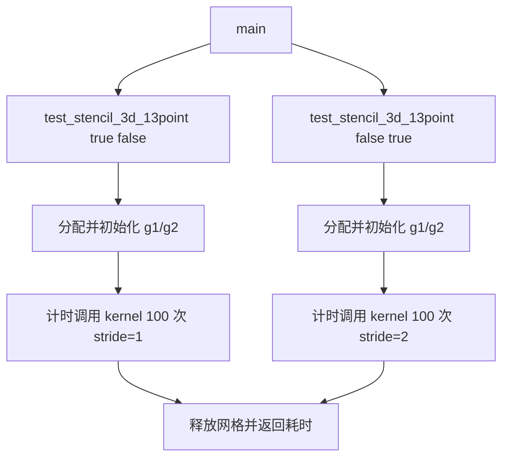

# 3D13P SME 测试用例执行流程

本目录的 `stencil_all_sme.cpp` 是从服务器抄写的一个 3D 13-point stencil
测试用例片段。它包含一个 SME kernel、一个计时驱动函数和一个简化的 `main`。

## 1. 整体调用流程



当前抄写版本没有保留服务器 `main` 的完整参数解析，只用两次直接调用分别执行
stride=1 和 stride=2。原程序中“根据参数判断执行哪些 stencil 用例”和汇总总时间
的部分以注释代替。

## 2. 测试驱动流程

`test_stencil_3d_13point(run_stride1, run_stride2)` 执行以下步骤：

1. 固定问题规模为 `DEPTH=128`、`ROWS=512`、`COLS=512`。
2. 使用 64-byte 对齐分别分配输入 `g1` 和输出 `g2`。每个数组包含
   33,554,432 个 `double`，约 256 MiB，两个数组合计约 512 MiB。
3. 对启用的 stride 场景，在计时开始前把 `g1` 初始化为随三维下标递增的值。
4. 启动 `high_resolution_clock`，连续调用 kernel 100 次。
5. 输出这 100 次调用的总耗时，并累加到 `total_time`。
6. 释放 `g1/g2`，返回本次测试中所有已启用场景的总耗时。

100 次调用始终读取 `g1`、写入 `g2`，没有交换两个数组。因此它测量的是同一个
stencil sweep 的重复执行，不是将前一次输出作为下一次输入的时间步推进。

## 3. Kernel 执行流程

`stencil3D_13point_sme` 通过 `__arm_new("za")` 请求新的 ZA 状态，并在 SME
streaming mode 中运行。其主体流程如下：

1. 调用 `svcntd()` 获取当前 streaming vector length 可容纳的 `double` 元素数
   `SVL`。
2. 计算一个平面的元素数 `plane_size = rows * cols`，并准备权重 `1/13`、全 1
   向量和 SVE 全真谓词。
3. 三层循环遍历内部区域：`k` 和 `i` 从 1 到边界前一层，`j` 每次前进
   `SVL * stride`。
4. 使用 `svwhilelt_b64` 生成 `j` 方向的尾部谓词，避免最后一个向量越过当前行的
   有效计算范围。
5. 根据 `base_idx = k*plane_size + i*cols + j` 计算中心地址，并从当前平面、相邻
   行和相邻平面加载 13 个 SVE 向量。
6. 调用 `svzero_za()` 清空 ZA tile。
7. 对 13 个输入向量依次执行 `svmopa_za64_f64_m`。左操作数是全 1 向量，因此
   ZA 的有效行累加这 13 个向量对应位置的值。
8. 使用 `svread_hor_za64_m` 读出 ZA 累加结果，乘以 `1/13` 得到 13 点平均值。
9. 在尾部谓词控制下把结果写入 `new_grid[base_idx]`。

`stride=2` 时，`k/i` 每次跳过一层或一行，`j` 每次跳过一个额外向量块；单次
`svld1_f64` 仍加载连续元素，并不是对向量内部元素执行步长为 2 的 gather。

## 4. 计时范围与输出

计时范围只覆盖下面的循环：

```cpp
for (int iter = 0; iter < 100; iter++)
    stencil3D_13point_sme(...);
```

内存分配、输入初始化、日志输出和释放均不计入 `Time:`。因此这里的时间应理解为
100 次 kernel sweep 的墙钟总时间，单次平均时间需要再除以 100。

当前片段没有 reference kernel、结果比较或误差检查，因此它只能测量运行时间，
不能独立验证 SME 结果的正确性。

## 5. 当前抄写版本的注意事项

该文件保留了若干明显的抄写或截取问题，不能直接作为可编译版本：

- `voud` 应为 `void`。
- `__arm_streamint` 应核对为编译器支持的 SME streaming 属性写法。
- `stdcout` 应为 `std::cout`。
- `sstl_f64` 应核对原文件中的 SVE store intrinsic，通常应为 `svst1_f64`。
- 名为 `kp1_i0_jp1` 的 load 实际使用了 `(k-1, j+1)`，需要与服务器原文件核对它
  是否应为 `(k+1, j+1)`。
- `argc/argv` 当前没有参与分发，命令行参数逻辑和总时间输出已被省略。
- 没有检查 `aligned_alloc` 是否失败，也没有初始化或校验输出边界。

在分析 LLVM IR 或评估预取效果前，应先与服务器原文件核对这些位置；否则编译错误
或邻域下标错误可能被误判为 Pass 或预取模型问题。
