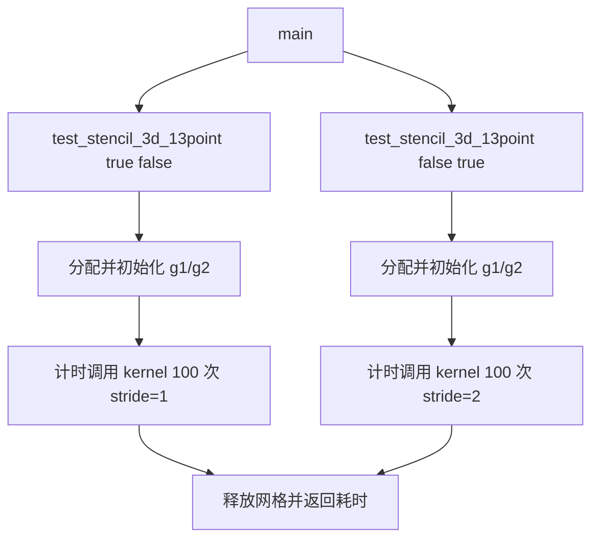

# 3D13P SME 测试用例执行流程

本目录的 `stencil_all_sme.cpp` 是从服务器抄写的一个 3D 13-point stencil
测试用例片段。它包含一个 SME kernel、一个计时驱动函数和一个简化的 `main`。

## 1. 整体调用流程



当前抄写版本没有保留服务器 `main` 的完整参数解析，只用两次直接调用分别执行
stride=1 和 stride=2。原程序中“根据参数判断执行哪些 stencil 用例”和汇总总时间
的部分以注释代替。

## 2. 测试驱动流程

`test_stencil_3d_13point(run_stride1, run_stride2)` 执行以下步骤：

1. 固定问题规模为 `DEPTH=128`、`ROWS=512`、`COLS=512`。
2. 使用 64-byte 对齐分别分配输入 `g1` 和输出 `g2`。每个数组包含
   33,554,432 个 `double`，约 256 MiB，两个数组合计约 512 MiB。
3. 对启用的 stride 场景，在计时开始前把 `g1` 初始化为随三维下标递增的值。
4. 启动 `high_resolution_clock`，连续调用 kernel 100 次。
5. 输出这 100 次调用的总耗时，并累加到 `total_time`。
6. 释放 `g1/g2`，返回本次测试中所有已启用场景的总耗时。

100 次调用始终读取 `g1`、写入 `g2`，没有交换两个数组。因此它测量的是同一个
stencil sweep 的重复执行，不是将前一次输出作为下一次输入的时间步推进。

## 3. Kernel 执行流程

`stencil3D_13point_sme` 通过 `__arm_new("za")` 请求新的 ZA 状态，并在 SME
streaming mode 中运行。其主体流程如下：

1. 调用 `svcntd()` 获取当前 streaming vector length 可容纳的 `double` 元素数
   `SVL`。
2. 计算一个平面的元素数 `plane_size = rows * cols`，并准备权重 `1/13`、全 1
   向量和 SVE 全真谓词。
3. 三层循环遍历内部区域：`k` 和 `i` 从 1 到边界前一层，`j` 每次前进
   `SVL * stride`。
4. 使用 `svwhilelt_b64` 生成 `j` 方向的尾部谓词，避免最后一个向量越过当前行的
   有效计算范围。
5. 根据 `base_idx = k*plane_size + i*cols + j` 计算中心地址，并从当前平面、相邻
   行和相邻平面加载 13 个 SVE 向量。
6. 调用 `svzero_za()` 清空 ZA tile。
7. 对 13 个输入向量依次执行 `svmopa_za64_f64_m`。左操作数是全 1 向量，因此
   ZA 的有效行累加这 13 个向量对应位置的值。
8. 使用 `svread_hor_za64_m` 读出 ZA 累加结果，乘以 `1/13` 得到 13 点平均值。
9. 在尾部谓词控制下把结果写入 `new_grid[base_idx]`。

`stride=2` 时，`k/i` 每次跳过一层或一行，`j` 每次跳过一个额外向量块；单次
`svld1_f64` 仍加载连续元素，并不是对向量内部元素执行步长为 2 的 gather。

## 4. 计时范围与输出

计时范围只覆盖下面的循环：

```cpp
for (int iter = 0; iter < 100; iter++)
    stencil3D_13point_sme(...);
```

内存分配、输入初始化、日志输出和释放均不计入 `Time:`。因此这里的时间应理解为
100 次 kernel sweep 的墙钟总时间，单次平均时间需要再除以 100。

当前片段没有 reference kernel、结果比较或误差检查，因此它只能测量运行时间，
不能独立验证 SME 结果的正确性。

## 5. 源码逐语句说明

下面的行号对应 [stencil_all_sme.cpp](stencil_all_sme.cpp)。空行和仅用于结束作用域的
右花括号不单独列出；跨多行组成的同一条语句合并说明。

### 5.1 头文件与 Kernel 声明

| 行号 | 语句 | 作用 |
|---:|---|---|
| 1 | `#include <arm_sme.h>` | 引入 SME ZA tile、MOPA 和 ZA 读写相关 ACLE 声明。 |
| 2 | `#include <arm_sve.h>` | 引入 SVE 向量类型、谓词、加载、存储和向量运算声明。 |
| 3 | `#include <chrono>` | 提供测试函数使用的高精度墙钟计时接口。 |
| 4 | `#include <iostream>` | 提供 `std::cout` 和 `std::endl` 输出接口。 |
| 5 | `#include <cstdlib>` | 提供 `aligned_alloc` 和 `free`。 |
| 6 | `#include <cstring>` | 引入 C 字符串接口；当前片段没有实际使用。 |
| 9 | `__arm_new("za")` | 声明函数进入时使用新的 ZA 状态，避免依赖调用者原有 ZA 内容。 |
| 10 | `voud stencil3D_13point_sme(...)` | 声明输入、输出、三维尺寸和 stride；其中 `voud` 是抄写错误，应核对为 `void`。`__restrict__` 表示两个网格不别名。 |
| 11 | `__arm_streamint {` | 原意是声明 streaming mode 并开始函数体；属性名称存在抄写错误，需要与服务器源码核对。 |

### 5.2 Kernel 初始化与循环控制

| 行号 | 语句 | 作用 |
|---:|---|---|
| 12 | `uint64_t SVL = svcntd();` | 读取当前 streaming VL 中的 64-bit lane 数，即一次 SVE `double` 向量最多处理的元素数。 |
| 13 | `int plane_size = rows * cols;` | 计算一个二维平面的元素数，用于把 `(k,i,j)` 线性化。 |
| 14 | `weight_vec = svdup_f64(1.0 / 13.0)` | 创建所有 lane 都为 `1/13` 的向量，用于把 13 项之和转换为平均值。 |
| 15 | `ones = svdup_f64(1.0)` | 创建全 1 向量，作为每次 ZA 外积的纵向操作数。 |
| 16 | `pg_all = svptrue_b64()` | 创建全部 64-bit lane 有效的谓词，控制 ZA 的纵向维度。 |
| 18 | `for (k=1; k<depth-1; k+=stride)` | 遍历内部平面，跳过前后边界；stride=2 时每次跳过一个平面。 |
| 19 | `for (i=1; i<rows-1; i+=stride)` | 遍历内部行，跳过上下边界；stride=2 时每次跳过一行。 |
| 20 | `for (j=1; j<cols-1; j+=SVL*stride)` | 沿连续维按向量块前进；stride=2 跳过整个向量块，并非 lane 内隔点加载。 |
| 21 | `j_limit = min(cols-1, j+SVL*stride-1)` | 计算当前迭代采用的上界。stride=1 时接近一个向量宽度；stride=2 时该上界大于一个向量宽度，但谓词最多仍只有 `SVL` 个 lane。 |
| 22 | `pg = svwhilelt_b64(j, j_limit + 1)` | 为当前向量生成尾部谓词，lane 对应下标小于等于 `j_limit` 时有效。 |
| 23 | `if (!svptest_any(..., pg)) break;` | 若当前谓词没有有效 lane，则结束 `j` 循环。正常循环条件下通常不会触发。 |
| 25 | `base_idx = k*plane_size + i*cols + j` | 计算当前输出向量起点 `(k,i,j)` 的一维数组下标。 |

### 5.3 13 个输入向量

下表中的坐标均相对于当前 `(k,i,j)`；每条 `svld1_f64` 在 `pg` 控制下加载一个
连续 SVE 向量。

| 行号 | 变量 | 相对坐标 | 作用 |
|---:|---|---|---|
| 27 | `center` | `(0,0,0)` | 加载中心向量。 |
| 29 | `k1_i0_j0` | `(-1,0,0)` | 加载前一个平面的同位置向量。 |
| 30 | `kp1_i0_j0` | `(+1,0,0)` | 加载后一个平面的同位置向量。 |
| 31 | `k0_i1_j0` | `(0,-1,0)` | 加载当前平面的上一行。 |
| 32 | `k0_ip1_j0` | `(0,+1,0)` | 加载当前平面的下一行。 |
| 33 | `k0_i0_j1` | `(0,0,-1)` | 从 `j-1` 开始连续加载；它与中心流存在横向偏移。 |
| 34 | `k0_i0_jp1` | `(0,0,+1)` | 从 `j+1` 开始连续加载。 |
| 36 | `k1_i1_j0` | `(-1,-1,0)` | 加载前一平面的上一行。 |
| 37 | `k1_ip1_j0` | `(-1,+1,0)` | 加载前一平面的下一行。 |
| 38 | `kp1_i1_j0` | `(+1,-1,0)` | 加载后一平面的上一行。 |
| 39 | `kp1_ip1_j0` | `(+1,+1,0)` | 加载后一平面的下一行。 |
| 41 | `k1_i0_j1` | `(-1,0,-1)` | 加载前一平面中从 `j-1` 开始的向量。 |
| 42 | `kp1_i0_jp1` | 代码实际为 `(-1,0,+1)` | 变量名表示 `k+1`，但地址使用 `k-1`；必须核对原代码是否应为 `(+1,0,+1)`。 |

### 5.4 ZA 累加和结果写回

| 行号 | 语句 | 作用 |
|---:|---|---|
| 44 | `svzero_za();` | 每个输出向量开始前清空 ZA，防止累加上一次 `j` 迭代的结果。 |
| 46 | 对 `center` 执行 `svmopa_za64_f64_m` | 把中心向量作为第 1 项累加到 ZA tile 0。 |
| 48 | 对 `k1_i0_j0` 执行 MOPA | 累加 `(-1,0,0)`，第 2 项。 |
| 49 | 对 `kp1_i0_j0` 执行 MOPA | 累加 `(+1,0,0)`，第 3 项。 |
| 50 | 对 `k0_i1_j0` 执行 MOPA | 累加 `(0,-1,0)`，第 4 项。 |
| 51 | 对 `k0_ip1_j0` 执行 MOPA | 累加 `(0,+1,0)`，第 5 项。 |
| 52 | 对 `k0_i0_j1` 执行 MOPA | 累加 `(0,0,-1)`，第 6 项。 |
| 53 | 对 `k0_i0_jp1` 执行 MOPA | 累加 `(0,0,+1)`，第 7 项。 |
| 55 | 对 `k1_i1_j0` 执行 MOPA | 累加 `(-1,-1,0)`，第 8 项。 |
| 56 | 对 `k1_ip1_j0` 执行 MOPA | 累加 `(-1,+1,0)`，第 9 项。 |
| 57 | 对 `kp1_i1_j0` 执行 MOPA | 累加 `(+1,-1,0)`，第 10 项。 |
| 58 | 对 `kp1_ip1_j0` 执行 MOPA | 累加 `(+1,+1,0)`，第 11 项。 |
| 59 | 对 `k1_i0_j1` 执行 MOPA | 累加 `(-1,0,-1)`，第 12 项。 |
| 60 | 对 `kp1_i0_jp1` 执行 MOPA | 累加第 13 项；其真实坐标取决于第 42 行是否抄写正确。 |
| 62 | `sum = svread_hor_za64_m(...)` | 从 ZA tile 0 的第 0 行读出 13 次外积形成的逐 lane 累加结果。 |
| 63 | `result = svmul_f64_z(pg, sum, weight_vec)` | 有效 lane 乘以 `1/13`；无效 lane 清零。 |
| 64 | `sstl_f64(pg, &new_grid[base_idx], result)` | 把结果写回输出网格；`sstl_f64` 是疑似抄写错误，应核对为实际 SVE store intrinsic。 |
| 66-69 | 结束三层循环和函数 | 完成所有内部平面、行和向量块的处理；边界元素不写入。 |

### 5.5 测试函数

| 行号 | 语句 | 作用 |
|---:|---|---|
| 71 | `test_stencil_3d_13point(bool, bool)` | 定义可分别启用 stride=1 和 stride=2 的测试驱动，并返回已执行场景的总耗时。 |
| 72 | 输出 `------3d13p-----` | 打印当前算子标题；不在 kernel 计时区间内。 |
| 73 | 定义 `128 x 512 x 512` | 固定测试问题规模。 |
| 74 | `aligned_alloc(...g1...)` | 分配约 256 MiB、64-byte 对齐的输入网格。 |
| 75 | `aligned_alloc(...g2...)` | 分配约 256 MiB、64-byte 对齐的输出网格。 |
| 77 | `total_time = 0.0` | 初始化两个可选 stride 场景的累计耗时。 |
| 78 | `double elapsed` | 声明单个场景的耗时变量。 |
| 80 | `if (run_stride1)` | 只有调用者请求 stride=1 时才进入第一段测试。 |
| 81-84 | 三层初始化循环 | 在计时前给 `g1[k,i,j]` 写入 `1 + linear_index`；`g2` 未初始化。 |
| 85 | 输出 `stride=1...` | 标记即将执行 stride=1。 |
| 86 | `start = now()` | 记录 stride=1 的计时起点。 |
| 87 | 100 次调用，`stride=1` | 重复执行完整内部网格 sweep；每次都读取 `g1` 并覆盖 `g2`。 |
| 88 | `end = now()` | 记录 stride=1 的计时终点。 |
| 89 | `elapsed = duration(end-start)` | 把 100 次调用的墙钟时间转换为秒。 |
| 90 | 输出 `Time:` | 打印该场景耗时；`stdcout` 是抄写错误。 |
| 91 | `total_time += elapsed` | 把 stride=1 时间加入返回值。 |
| 94 | `if (run_stride2)` | 只有调用者请求 stride=2 时才进入第二段测试。 |
| 95-98 | 再次初始化 `g1` | 在 stride=2 计时前恢复相同输入数据；仍不初始化 `g2`。 |
| 99 | 输出 `stride=2...` | 标记即将执行 stride=2。 |
| 100 | `start = now()` | 记录 stride=2 的计时起点。 |
| 101 | 100 次调用，`stride=2` | 以跳平面、跳行和跳向量块方式重复执行 kernel。 |
| 102 | `end = now()` | 记录 stride=2 的计时终点。 |
| 103 | 计算 `elapsed` | 得到 stride=2 的 100 次调用总秒数。 |
| 104 | 输出 `Time:` | 打印 stride=2 耗时；同样存在 `stdcout` 抄写错误。 |
| 105 | `total_time += elapsed` | 把 stride=2 时间加入返回值。 |
| 108 | `free(g1); free(g2);` | 在两个可选场景完成后释放约 512 MiB 网格。 |
| 109 | `return total_time;` | 返回本次函数实际执行场景的耗时之和。 |

### 5.6 `main` 入口

| 行号 | 语句 | 作用 |
|---:|---|---|
| 112 | `int main(int argc, char* argv[])` | 程序入口；当前片段保留参数，但没有读取它们。 |
| 113 | 参数分发注释 | 表示服务器原程序会根据类似 `--3d13p-s1` 的参数选择测试，本片段省略了实现。 |
| 114 | `test_stencil_3d_13point(true, false)` | 分配一套网格并只执行 stride=1，返回值未保存。 |
| 115 | `test_stencil_3d_13point(false, true)` | 再分配一套网格并只执行 stride=2，返回值未保存。 |
| 116 | 总时间注释 | 表示原程序还会累计并输出总时间，本片段省略了实现。 |
| 117 | 结束 `main` | C++ 中到达 `main` 末尾等价于返回 0。 |

## 6. 当前抄写版本的注意事项

该文件保留了若干明显的抄写或截取问题，不能直接作为可编译版本：

- `voud` 应为 `void`。
- `__arm_streamint` 应核对为编译器支持的 SME streaming 属性写法。
- `stdcout` 应为 `std::cout`。
- `sstl_f64` 应核对原文件中的 SVE store intrinsic，通常应为 `svst1_f64`。
- 名为 `kp1_i0_jp1` 的 load 实际使用了 `(k-1, j+1)`，需要与服务器原文件核对它
  是否应为 `(k+1, j+1)`。
- `argc/argv` 当前没有参与分发，命令行参数逻辑和总时间输出已被省略。
- 没有检查 `aligned_alloc` 是否失败，也没有初始化或校验输出边界。

在分析 LLVM IR 或评估预取效果前，应先与服务器原文件核对这些位置；否则编译错误
或邻域下标错误可能被误判为 Pass 或预取模型问题。
