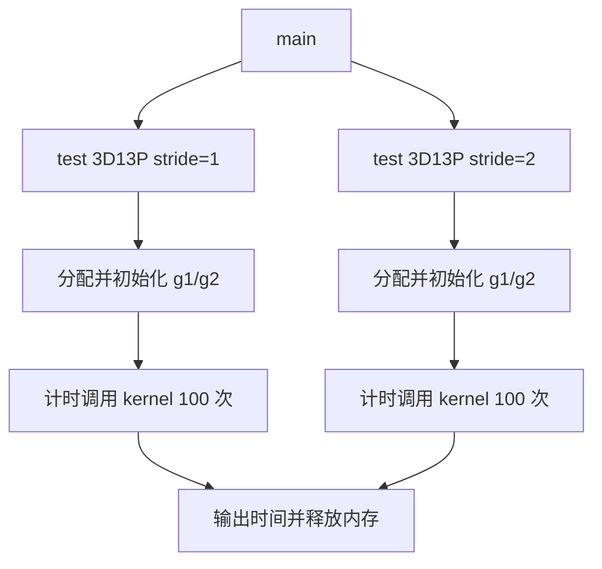
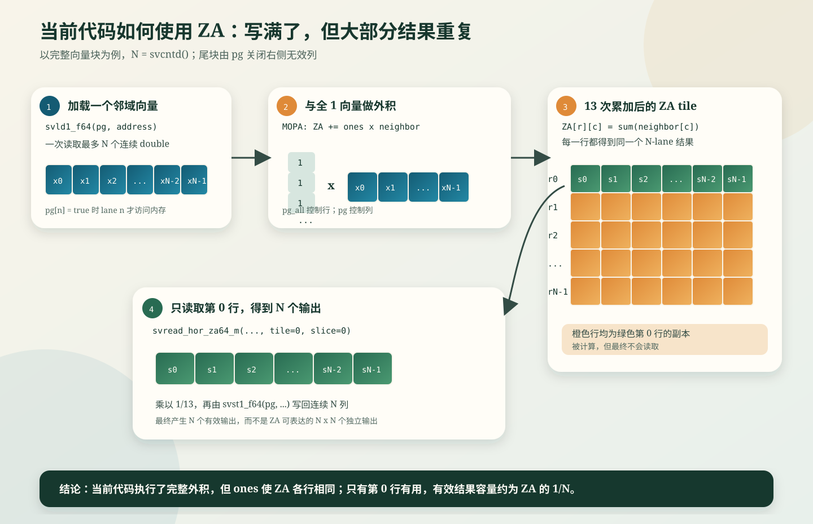
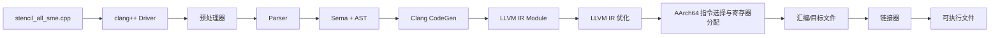
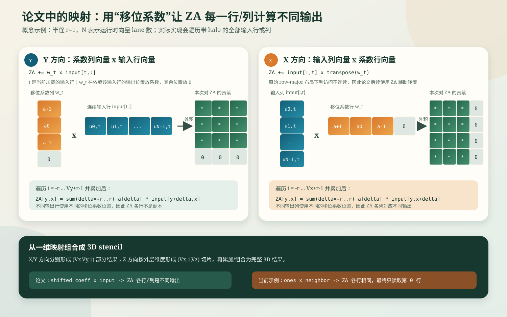
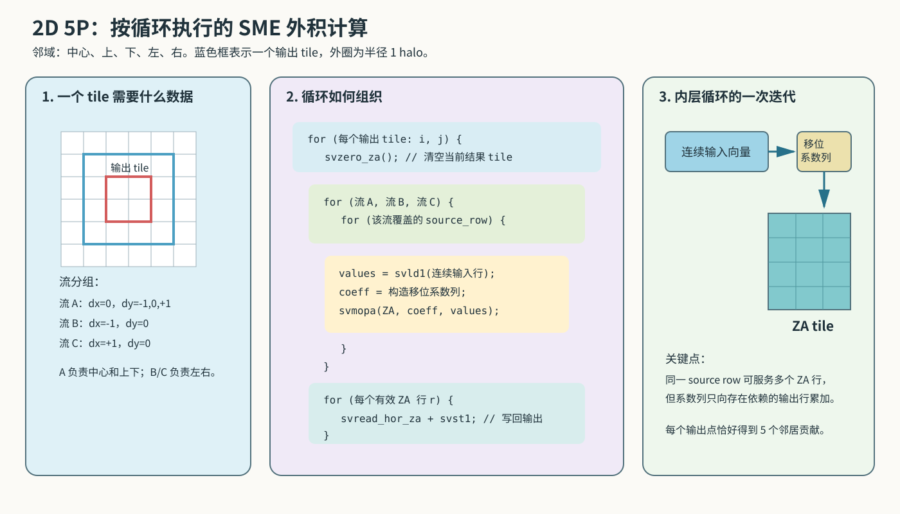
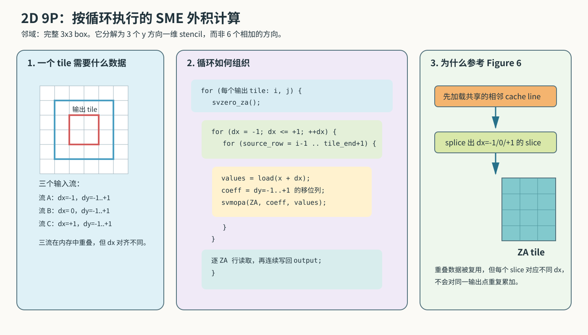
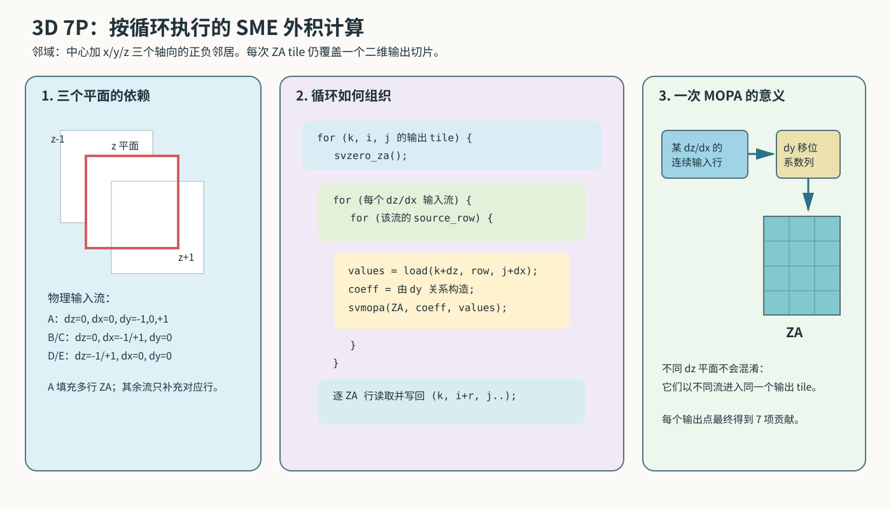
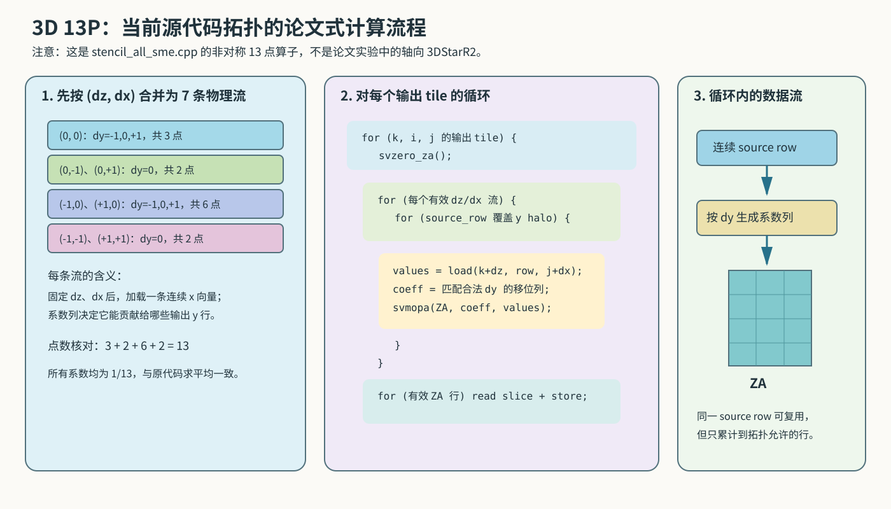

# SME 测试用例执行与编译流程

## 1. 3D13P SME 测试用例执行流程

### 1.1 总体说明执行流程

本目录的 `stencil_all_sme.cpp` 是从服务器抄写的 3D 13-point stencil 测试片段，
由三个部分组成：

1. `main`：选择要执行的测试场景。
2. `test_stencil_3d_13point`：分配数据、初始化输入、计时并重复调用 kernel。
3. `stencil3D_13point_sme`：使用 SVE 加载 13 个邻域向量，通过 SME ZA 完成累加和
   平均值计算。



测试规模固定为 `128 x 512 x 512`。`g1` 和 `g2` 各包含 33,554,432 个
`double`，每个约 256 MiB，合计约 512 MiB。内存分配和输入初始化不在计时范围内；
`Time:` 表示 100 次 kernel sweep 的墙钟总时间，单次平均时间需要除以 100。

100 次调用始终读取 `g1` 并覆盖 `g2`，两个数组不会交换。因此该测试不是 100 个
相互依赖的时间步，而是对同一个输入重复执行相同计算。当前片段也没有 reference
kernel 或结果比较，只能测量运行时间，不能独立验证计算正确性。

kernel 的执行顺序为：

```text
获取 streaming VL
  -> 遍历内部 k/i/j
  -> 生成 j 方向尾部谓词
  -> 加载中心和 12 个邻域向量
  -> 清空 ZA
  -> 执行 13 次 MOPA 累加
  -> 从 ZA 读出结果
  -> 乘以 1/13
  -> 写入 new_grid
```

`stride=2` 只让 `k/i` 跳过平面或行，并让 `j` 跳过一个完整向量块。单次
`svld1_f64` 仍然加载连续元素，不是 lane 内步长为 2 的 gather。

### 1.2 以代码块形式逐语句说明

以下代码块保持原文件的语句和顺序，并用 `//` 注释解释。注释不属于服务器原代码。
其中明显的抄写错误不会直接修正，而是在对应位置标出。

#### 1.2.1 头文件和 Kernel 声明

```cpp
// 引入 SME ZA tile、MOPA 和 ZA 读写相关 ACLE 声明。
#include <arm_sme.h>

// 引入 SVE 向量类型、谓词、加载、存储和向量运算声明。
#include <arm_sve.h>

// 提供 high_resolution_clock 和 duration。
#include <chrono>

// 提供 std::cout 和 std::endl。
#include <iostream>

// 提供 aligned_alloc 和 free。
#include <cstdlib>

// 提供 C 字符串接口；当前片段没有实际使用。
#include <cstring>

// 请求函数进入时使用新的 ZA 状态。
__arm_new("za")

// 声明输入网格、输出网格、三维尺寸和 stride。
// __restrict__ 表示 grid 与 new_grid 不发生别名。
void stencil3D_13point_sme(
    double* __restrict__ grid,
    double* __restrict__ new_grid,
    int depth, int rows, int cols, int stride)

// 声明函数在 SME streaming mode 中运行并开始函数体。
__arm_streaming {
```

#### 1.2.2 Kernel 初始化和循环控制

```cpp
    // 返回当前 streaming vector length 能容纳的 double lane 数。
    // 例如 streaming VL=512 bit 时，SVL=512/64=8。
    uint64_t SVL = svcntd();

    // 一个 k 平面包含 rows*cols 个 double，用于三维下标线性化。
    int plane_size = rows * cols;

    // 创建所有 lane 都为 1/13 的向量，最后用于计算平均值。
    svfloat64_t weight_vec = svdup_f64(1.0 / 13.0);

    // 创建全 1 向量，作为每次 ZA 外积的纵向操作数。
    svfloat64_t ones = svdup_f64(1.0);

    // 创建所有 64-bit lane 都有效的谓词，控制 ZA 纵向维度。
    svbool_t pg_all = svptrue_b64();

    // 从 k=1 开始，避开第 0 个平面和最后一个平面。
    // stride=2 时每次跳过一个平面。
    for (int k = 1; k < depth - 1; k += stride) {

        // 从 i=1 开始，避开第 0 行和最后一行。
        // stride=2 时每次跳过一行。
        for (int i = 1; i < rows - 1; i += stride) {

            // j 沿连续维按向量块前进。
            // stride=2 时跳过一个完整向量块，不是隔元素加载。
            for (int j = 1; j < cols - 1; j += SVL * stride) {

                // 计算当前迭代采用的 j 上界。
                // stride=2 时该范围可大于一个向量，但谓词最多仍有 SVL 个 lane。
                int j_limit = (cols - 1 < j + SVL * stride - 1)
                                  ? cols - 1
                                  : j + SVL * stride - 1;

                // 为当前 j 向量块生成一个 64-bit lane 谓词。
                // 第 n 个 lane 对应列 j+n；仅当 j+n < j_limit+1 时置为 true。
                // 因此完整向量块得到全 true，尾部不足 SVL 个元素时只打开前几个 lane。
                svbool_t pg = svwhilelt_b64(j, j_limit + 1);

                // 若谓词中没有有效 lane，则结束 j 循环。
                if (!svptest_any(svptrue_b64(), pg))
                    break;

                // 把当前坐标 (k,i,j) 转换为一维数组起始下标。
                int base_idx = k * plane_size + i * cols + j;
```

`svwhilelt_b64(start, end)` 可以理解为按下面的规则生成谓词，其中 lane 数由运行时
streaming vector length 决定：

```text
pg[n] = (start + n < end),  0 <= n < SVL

这里：
start = j
end   = j_limit + 1
所以：pg[n] = (j + n <= j_limit)
```

例如 `SVL=8`，当前 `j=17`：

| `j_limit` | `pg` 的 8 个 lane | 实际处理的列 |
|---|---|---|
| 24 | `T T T T T T T T` | 17 到 24，共 8 列 |
| 21 | `T T T T T F F F` | 17 到 21，共 5 列 |
| 16 | `F F F F F F F F` | 没有可处理列，`svptest_any` 为 false |

这个 `pg` 会贯穿当前 `j` 迭代：

1. `svld1_f64(pg, address)` 只读取 true lane 对应的连续地址，false lane 不访问内存；
2. `svmopa_za64_f64_m(..., pg_all, pg, ...)` 用 `pg` 限制 ZA 外积的列方向；
3. `svmul_f64_z(pg, ...)` 只计算有效 lane，并把无效 lane 置零；
4. `svst1_f64(pg, address, result)` 只写回有效 lane。

因此 `pg` 的主要作用是让同一套向量指令既能处理完整向量块，也能安全处理不足
`SVL` 个元素的尾块。它不决定向量寄存器的物理长度，只决定本次操作中哪些 lane
参与计算和访存。

还要注意，`stride=2` 时 `pg` **不会**变成 `T F T F ...`，也不会执行 gather。
当前代码仍连续处理最多 `SVL` 列，只是下一轮 `j += 2*SVL`，从而跳过中间的一个
完整向量块。

下面的图展示当前代码从一个邻域向量加载、ZA 外积累加到读取第 0 行的完整过程：



图中的 `s0...sN-1` 表示 13 个邻域向量在对应 lane 上的累加和。由于外积的第一个
向量始终为 `ones`，ZA 每一行都得到同一份结果；代码最终只通过
`svread_hor_za64_m(..., 0, 0)` 读取第 0 行。因此 ZA 在完整向量块中会被写入，但
没有形成 `N x N` 个彼此不同的输出，其他行的重复结果没有被使用。

这里需要注意尾部边界：`j_limit` 最多取 `cols-1`，随后谓词使用
`j_limit+1`，因此可能允许输出列 `cols-1`。对于需要访问 `j+1` 的邻域，最末 lane
还可能跨到下一行。分析预取前应与服务器原代码核对这里是否应限制到 `cols-2`。

#### 1.2.3 加载 13 个输入向量

```cpp
                // (0,0,0)：加载中心向量。
                svfloat64_t center =
                    svld1_f64(pg, &grid[base_idx]);

                // (-1,0,0)：前一个平面的同位置向量。
                svfloat64_t k1_i0_j0 =
                    svld1_f64(pg, &grid[(k - 1) * plane_size + i * cols + j]);

                // (+1,0,0)：后一个平面的同位置向量。
                svfloat64_t kp1_i0_j0 =
                    svld1_f64(pg, &grid[(k + 1) * plane_size + i * cols + j]);

                // (0,-1,0)：当前平面的上一行。
                svfloat64_t k0_i1_j0 =
                    svld1_f64(pg, &grid[k * plane_size + (i - 1) * cols + j]);

                // (0,+1,0)：当前平面的下一行。
                svfloat64_t k0_ip1_j0 =
                    svld1_f64(pg, &grid[k * plane_size + (i + 1) * cols + j]);

                // (0,0,-1)：从中心左侧一个元素开始连续加载。
                svfloat64_t k0_i0_j1 =
                    svld1_f64(pg, &grid[k * plane_size + i * cols + (j - 1)]);

                // (0,0,+1)：从中心右侧一个元素开始连续加载。
                svfloat64_t k0_i0_jp1 =
                    svld1_f64(pg, &grid[k * plane_size + i * cols + (j + 1)]);

                // (-1,-1,0)：前一平面的上一行。
                svfloat64_t k1_i1_j0 = svld1_f64(
                    pg, &grid[(k - 1) * plane_size + (i - 1) * cols + j]);

                // (-1,+1,0)：前一平面的下一行。
                svfloat64_t k1_ip1_j0 = svld1_f64(
                    pg, &grid[(k - 1) * plane_size + (i + 1) * cols + j]);

                // (+1,-1,0)：后一平面的上一行。
                svfloat64_t kp1_i1_j0 = svld1_f64(
                    pg, &grid[(k + 1) * plane_size + (i - 1) * cols + j]);

                // (+1,+1,0)：后一平面的下一行。
                svfloat64_t kp1_ip1_j0 = svld1_f64(
                    pg, &grid[(k + 1) * plane_size + (i + 1) * cols + j]);

                // (-1,0,-1)：前一平面中从 j-1 开始的向量。
                svfloat64_t k1_i0_j1 = svld1_f64(
                    pg, &grid[(k - 1) * plane_size + i * cols + (j - 1)]);

                // (+1,0,+1)：后一平面中从 j+1 开始的向量。
                svfloat64_t kp1_i0_jp1 = svld1_f64(
                    pg, &grid[(k + 1) * plane_size + i * cols + (j + 1)]);
```

`svld1_f64(pg, address)` 的第 `n` 个有效 lane 加载 `address[n]`。逻辑加载量为
`有效 lane 数 x 8 byte`；无效 lane 不访问内存。处理完整向量时，一条加载最多读取
`SVL x 8 byte`，但硬件 cache 传输仍以 cache line 为基本粒度。

#### 1.2.4 ZA 累加、缩放和写回

```cpp
                // 每个输出向量开始前清空 ZA，避免保留上一次 j 迭代的结果。
                svzero_za();

                // 第 1 项：累加中心向量。
                svmopa_za64_f64_m(0, pg_all, pg, ones, center);

                // 第 2 项：累加 (-1,0,0)。
                svmopa_za64_f64_m(0, pg_all, pg, ones, k1_i0_j0);

                // 第 3 项：累加 (+1,0,0)。
                svmopa_za64_f64_m(0, pg_all, pg, ones, kp1_i0_j0);

                // 第 4 项：累加 (0,-1,0)。
                svmopa_za64_f64_m(0, pg_all, pg, ones, k0_i1_j0);

                // 第 5 项：累加 (0,+1,0)。
                svmopa_za64_f64_m(0, pg_all, pg, ones, k0_ip1_j0);

                // 第 6 项：累加 (0,0,-1)。
                svmopa_za64_f64_m(0, pg_all, pg, ones, k0_i0_j1);

                // 第 7 项：累加 (0,0,+1)。
                svmopa_za64_f64_m(0, pg_all, pg, ones, k0_i0_jp1);

                // 第 8 项：累加 (-1,-1,0)。
                svmopa_za64_f64_m(0, pg_all, pg, ones, k1_i1_j0);

                // 第 9 项：累加 (-1,+1,0)。
                svmopa_za64_f64_m(0, pg_all, pg, ones, k1_ip1_j0);

                // 第 10 项：累加 (+1,-1,0)。
                svmopa_za64_f64_m(0, pg_all, pg, ones, kp1_i1_j0);

                // 第 11 项：累加 (+1,+1,0)。
                svmopa_za64_f64_m(0, pg_all, pg, ones, kp1_ip1_j0);

                // 第 12 项：累加 (-1,0,-1)。
                svmopa_za64_f64_m(0, pg_all, pg, ones, k1_i0_j1);

                // 第 13 项：累加 (+1,0,+1)。
                svmopa_za64_f64_m(0, pg_all, pg, ones, kp1_i0_jp1);

                // 从 ZA tile 0 的第 0 行读出逐 lane 累加结果。
                svfloat64_t sum =
                    svread_hor_za64_m(svundef_f64(), pg_all, 0, 0);

                // 有效 lane 乘以 1/13，无效 lane 清零。
                svfloat64_t result = svmul_f64_z(pg, sum, weight_vec);

                // 在 pg 控制下把有效 lane 写回 new_grid[base_idx]。
                svst1_f64(pg, &new_grid[base_idx], result);
            }
        }
    }
}
```

#### 1.2.5 测试函数

```cpp
// run_stride1/run_stride2 分别决定是否执行两个场景。
// 返回值是本次调用实际执行场景的耗时之和。
double test_stencil_3d_13point(bool run_stride1, bool run_stride2) {

    // 输出算子标题，不属于 kernel 计时范围。
    std::cout << std::endl << "------3d13p-----" << std::endl;

    // 固定测试规模为 128x512x512。
    const int DEPTH = 128, ROWS = 512, COLS = 512;

    // 分配约 256 MiB、64-byte 对齐的输入网格。
    double* g1 = (double*)aligned_alloc(
        64, DEPTH * ROWS * COLS * sizeof(double));

    // 分配约 256 MiB、64-byte 对齐的输出网格。
    double* g2 = (double*)aligned_alloc(
        64, DEPTH * ROWS * COLS * sizeof(double));

    // 初始化两个可选场景的累计耗时。
    double total_time = 0.0;

    // 保存单个场景的耗时。
    double elapsed;

    // 只有调用者请求 stride=1 时才执行第一段测试。
    if (run_stride1) {

        // 在计时前初始化 g1[k,i,j] = 1 + linear_index。
        // g2 没有初始化。
        for (int k = 0; k < DEPTH; k++)
            for (int i = 0; i < ROWS; i++)
                for (int j = 0; j < COLS; j++)
                    g1[k * ROWS * COLS + i * COLS + j] =
                        1.0 + (k * ROWS + i) * COLS + j;

        // 标记即将执行 stride=1。
        std::cout << "stride=1..." << std::endl;

        // 记录计时起点。
        auto start = std::chrono::high_resolution_clock::now();

        // 连续调用 100 次；每次读取相同 g1 并覆盖 g2。
        for (int iter = 0; iter < 100; iter++)
            stencil3D_13point_sme(g1, g2, DEPTH, ROWS, COLS, 1);

        // 记录计时终点。
        auto end = std::chrono::high_resolution_clock::now();

        // 计算 100 次调用的墙钟总秒数。
        elapsed = std::chrono::duration<double>(end - start).count();

        // 输出 stride=1 时间。
        std::cout << "Time:" << elapsed << std::endl;

        // 加入测试函数的总时间。
        total_time += elapsed;
    }

    // 只有调用者请求 stride=2 时才执行第二段测试。
    if (run_stride2) {

        // 在 stride=2 计时前重新写入与 stride=1 相同的输入。
        for (int k = 0; k < DEPTH; k++)
            for (int i = 0; i < ROWS; i++)
                for (int j = 0; j < COLS; j++)
                    g1[k * ROWS * COLS + i * COLS + j] =
                        1.0 + (k * ROWS + i) * COLS + j;

        // 标记即将执行 stride=2。
        std::cout << "stride=2..." << std::endl;

        // 记录计时起点。
        auto start = std::chrono::high_resolution_clock::now();

        // 连续调用 100 次 stride=2 kernel。
        for (int iter = 0; iter < 100; iter++)
            stencil3D_13point_sme(g1, g2, DEPTH, ROWS, COLS, 2);

        // 记录计时终点。
        auto end = std::chrono::high_resolution_clock::now();

        // 计算 stride=2 的 100 次调用总秒数。
        elapsed = std::chrono::duration<double>(end - start).count();

        // 输出 stride=2 时间。
        std::cout << "Time:" << elapsed << std::endl;

        // 加入测试函数的总时间。
        total_time += elapsed;
    }

    // 释放输入和输出网格。
    free(g1);
    free(g2);

    // 返回本次函数实际执行场景的耗时之和。
    return total_time;
}
```

当前代码没有检查 `aligned_alloc` 是否失败，也没有初始化或校验输出边界。

#### 1.2.6 `main` 入口

```cpp
// 程序入口保留 argc/argv，但当前片段没有读取命令行参数。
int main(int argc, char* argv[]) {

    // 服务器原程序会根据参数选择 stencil 用例；具体逻辑已被省略。
    // ...根据参数判断执行哪些stencil用例

    // 分配一套网格，只执行 stride=1；返回的耗时没有保存。
    test_stencil_3d_13point(true, false);

    // 再分配一套网格，只执行 stride=2；返回的耗时没有保存。
    test_stencil_3d_13point(false, true);

    // 服务器原程序还会累计并输出总时间；当前片段已省略。
    // ...记录并输出总运行时间

    // 到达 main 末尾等价于 return 0。
}
```

在分析 LLVM IR 或评估预取效果前，仍应核对第 23 行 `svptrue_b64` 是否应为
`svptrue_b64()`，并确认 `j_limit` 是否应将右边界限制到 `cols-2`。否则编译
错误或越界访问可能被误判为 Pass 或预取模型问题。

## 2. 毕昇编译器从 C++ 到 LLVM IR 的过程

### 2.1 毕昇与 LLVM/Clang 的关系

### 2.2 总体编译流水线



`clang++` 是编译驱动，不亲自完成所有转换。它分析命令行，确定目标架构、头文件
路径、优化等级和链接选项，然后生成前端、汇编器和链接器任务。可用
`$BISHENG_CXX -### stencil_all_sme.cpp` 只打印这些任务而不执行。

如果命令带 `-S -emit-llvm`，流水线在 LLVM IR 处停止并输出 `.ll`。`.ll` 不是
另一种 IR 层级，而是 LLVM IR 的文本表示；对应的二进制表示是 `.bc`。

### 2.3 各阶段做了什么

| 阶段 | 主要工作 | 输出或观察命令 | 上游源码入口 |
|---|---|---|---|
| Driver | 解析 `-target`、`-march`、`-O1` 等参数，组装编译任务 | `clang++ -###` | [`clang/tools/driver/driver.cpp`](https://github.com/llvm/llvm-project/blob/main/clang/tools/driver/driver.cpp)、[`clang/lib/Driver/Driver.cpp`](https://github.com/llvm/llvm-project/blob/main/clang/lib/Driver/Driver.cpp) |
| 预处理 | 展开 `#include`、宏和条件编译；找到毕昇资源目录中的 `arm_sve.h`、`arm_sme.h` | `clang++ -E` | [`clang/lib/Lex`](https://github.com/llvm/llvm-project/tree/main/clang/lib/Lex) |
| Parser | 将 token 解析为声明、表达式、循环和属性等语法结构 | 与 AST 一起观察 | [`clang/lib/Parse`](https://github.com/llvm/llvm-project/tree/main/clang/lib/Parse) |
| Sema/AST | 类型检查、重载解析、名称绑定，并验证 SME 属性与 ACLE 内建函数是否满足目标特性 | `-Xclang -ast-dump -fsyntax-only` | [`clang/lib/Sema`](https://github.com/llvm/llvm-project/tree/main/clang/lib/Sema)、[Clang AST 说明](https://clang.llvm.org/docs/IntroductionToTheClangAST.html) |
| CodeGen | 遍历 AST，把函数、循环、内存访问和目标内建函数转换为 LLVM IR | `-S -emit-llvm` | [`clang/lib/CodeGen/CodeGenAction.cpp`](https://github.com/llvm/llvm-project/blob/main/clang/lib/CodeGen/CodeGenAction.cpp)、[`CodeGenFunction.cpp`](https://github.com/llvm/llvm-project/blob/main/clang/lib/CodeGen/CodeGenFunction.cpp) |
| IR 优化 | 按 `-O0/-O1/-O2/-O3` 构造 Pass pipeline，执行内联、循环和标量优化等 | `-Rpass` 或 `-mllvm -debug-pass-manager`（是否可用取决于发行版） | [`clang/lib/CodeGen/BackendUtil.cpp`](https://github.com/llvm/llvm-project/blob/main/clang/lib/CodeGen/BackendUtil.cpp)、[`llvm/lib/Passes/PassBuilder.cpp`](https://github.com/llvm/llvm-project/blob/main/llvm/lib/Passes/PassBuilder.cpp) |
| AArch64 后端 | IR 指令选择、合法化、寄存器分配、调度和 MC 编码 | `-S` 生成 `.s`，`-c` 生成 `.o` | [`llvm/lib/Target/AArch64`](https://github.com/llvm/llvm-project/tree/main/llvm/lib/Target/AArch64)、[LLVM Code Generator](https://llvm.org/docs/CodeGenerator.html) |
| 链接 | 合并目标文件和 C/C++、SME ABI 等运行时，生成可执行文件 | 不加 `-S` 或 `-c` | 驱动选择的系统链接器或 LLD |

其中从驱动进入前端的关键调用链可以概括为：

```text
clang++ main
  -> Driver::BuildCompilation
  -> 执行 clang -cc1 前端任务
  -> ExecuteCompilerInvocation
  -> CompilerInstance::ExecuteAction
  -> Parser + Sema 构造 AST
  -> CodeGenAction / CodeGenerator 构造 llvm::Module
  -> EmitBackendOutput 运行 LLVM Pass pipeline 并输出 IR/汇编/目标文件
```

这是便于定位源码的逻辑调用链；不同 LLVM/毕昇版本中的辅助函数和内部调用层次可能
发生变化。

### 2.4 当前 SME kernel 如何转换

#### 2.4.1 头文件与函数属性

`arm_sve.h` 和 `arm_sme.h` 位于编译器资源目录中。它们主要提供 ACLE 类型、属性、
重载入口和内建函数映射，不包含一个像普通 `.cpp` 库那样的循环实现。因此
`svld1_f64`、`svmopa_za64_f64_m` 等调用通常不会编译成对同名外部函数的调用。

`__arm_streaming` 和 `__arm_new("za")` 先作为 Clang 能理解的函数属性进入 AST，
随后转换为 LLVM IR 中的 AArch64/SME 函数属性及状态约束。编译器还会检查
`-march` 是否包含这些操作要求的特性，例如 `sme-f64f64`。

#### 2.4.2 SVE/SME 操作

以 kernel 中的语句为例：

```text
svwhilelt_b64(...)       -> 构造可伸缩向量谓词
svld1_f64(pg, ptr)       -> 带谓词的 SVE 向量加载
svmopa_za64_f64_m(...)   -> SME ZA 外积累加语义
svread_hor_za64_m(...)   -> 从 ZA 水平切片读取向量
svst1_f64(pg, ptr, vec)  -> 带谓词的 SVE 向量存储
```

CodeGen 会把这些目标相关操作降为 `llvm.aarch64.sve.*` 或
`llvm.aarch64.sme.*` 一类 LLVM intrinsic，普通地址计算则表现为 `getelementptr`
（GEP），循环表现为基本块、`phi` 和条件分支。intrinsic 的确切名称和参数随 LLVM
版本变化，应以服务器生成的 `.ll` 为准。


## 3. SMEStencil 论文分析

### 3.1 论文信息与整体结构

本节分析本地论文
论文/SMEStencil_Optimizing_High-Order_Stencils_on_ARM_Multicore_Using_SME_Unit.pdf：

- 题目：*SMEStencil: Optimizing High-Order Stencils on ARM Multicore Using SME Unit*。
- 作者：Yinuo Wang、Tianqi Mao、Lin Gan 等。
- 期刊：IEEE Transactions on Parallel and Distributed Systems，Vol. 37，No. 3，
  2026 年 3 月。
- DOI：[10.1109/TPDS.2025.3650515](https://doi.org/10.1109/TPDS.2025.3650515)。

论文按照“提出问题、介绍背景、确认性能缺口、设计方案、扩展并行、实验验证、总结”
的顺序展开：

| 论文章节 | 主要作用 |
|---|---|
| I. Introduction | 说明高阶 3D stencil 的重要性、已有工作的不足和论文贡献 |
| II. Background | 介绍高阶 stencil、真实 RTM 需求、SME 和目标 ARM 多核 SoC |
| III. Related Work and Motivation | 回顾 CPU/GPU/矩阵单元方案，并用实验确认高阶 stencil 的性能缺口 |
| IV. Design of SMEStencil | 给出 stencil 到 SME 的映射、性能模型、微架构和内存优化 |
| V. Parallel Optimizations | 处理多线程私有缓存共享和跨 NUMA 通信 |
| VI. Experiments | 验证各项优化、整体性能、扩展性和 RTM 应用收益 |
| VII. Conclusion | 总结结论、适用边界和未来方向 |

### 3.2 第一章：Introduction

#### 3.2.1 本章提出的问题

高阶stencli的重要性。高阶stencli：半径通常大于1

但高阶 stencil 也带来新的性能困难：

- 邻域点数增加，传统 SIMD 的计算指令和调度压力增大；
- 半径扩大后，halo、工作集和跨平面访问增加，数据复用更困难；
- stencil 通常受内存限制，单纯增加矩阵计算吞吐率未必带来整体加速；
- 真实 HPC 应用会组合多种 stencil 和中间结果，单个 kernel 的加速不一定能转化为
  应用加速。

第一章提出的核心研究问题：如何让 SME 在不同维度、形状和半径的 stencil
上保持高利用率，并把 kernel 收益扩展到真实 HPC 应用。


#### 3.2.2 本章列出的贡献

论文把贡献概括为三个层次：

1. kernel 层：提出 SME 外积映射和四项 SME/SVE 微架构优化；
2. 内存与并行层：提出数据重排、gather 软件预取、cache-snoop 线程共享、SDMA
   NUMA 通信和流水重叠；
3. 应用层：给出把基本 stencil 算子集成到 VTI/TTI RTM 的方法，并验证端到端收益。

本章的作用是定义研究范围。后续第二章解释所需硬件和应用背景，第三章用实验确认
性能缺口，第四、第五章分别解决单核和并行问题。

### 3.5 第四章：Design of SMEStencil

依次介绍外积映射、初步性能模型、四项微架构优化、两项内存优化和真实应用集成。

#### 3.5.1 Mapping Stencil to the SME Unit

论文先将三维 stencil 分解为 x、y、z 三个方向的一维 stencil，再利用 SME 外积
一次更新 ZA 的多行或多列。设 ZA 中的输出块大小为 `(Vx, Vy)`，半径为 `r`，一维
系数为 `a[-r] ... a[r]`。

**y 方向映射**使用“移位系数列向量乘输入行向量”。处理输入行 `t` 时，从
`(Vx, Vy+2r)` 输入 patch 加载长度为 `Vx` 的连续行向量 `input[t,:]`，同时构造
形状为 `(Vy,1)` 的列向量 `w_t`：只有依赖输入行 `t` 的输出行位置包含对应
stencil 系数，其余位置为零。一次外积为：

```text
ZA += w_t x input[t,:]
```

遍历带 halo 的所有输入行并累加后：

```text
ZA[y,x] = sum(delta=-r..r) a[delta] * input[y+delta,x]
```

同一个输入行会按照不同系数贡献给相邻输出行。由于每次处理的 `t` 不同，系数向量
中的非零位置也随之移动，所以 ZA 各行最终对应不同的输出，而不是同一向量的副本。

**x 方向映射**采用对称形式“输入列向量乘移位系数行向量”：

```text
ZA += input[:,t] x transpose(w_t)

ZA[y,x] = sum(delta=-r..r) a[delta] * input[y,x+delta]
```

这里一个输入列同时向相邻输出列贡献数据。原始 row-major 网格中的列访问不连续，
因此论文随后在 3.5.3 中使用 ZA 的水平 load 和垂直 store 完成辅助转置，避免昂贵
的 gather 或大量 SVE permutation。



对于 z 方向，论文把最外层维度按相同思想处理。x/y 方向的一个 ZA tile 对应
`(Vx,Vy,1)` 切片，z 方向则采用 `(Vx,1,Vz)` 切片；复杂 3D stencil 通过组合三个
方向的部分结果形成。

这个映射不是先构造一个通用稠密矩阵再调用矩阵乘法，而是直接把 stencil 的局部
依赖编码进带零元素的移位系数向量。它也与第一部分的示例代码不同：示例使用
`ones x neighbor`，使 ZA 各行相同并只读取第 0 行；论文使用移位系数向量，使一次
外积真正为多个不同输出位置贡献数据。

##### 对应实现：与原代码一致的 3D 13-point

`smestencil_paper_3d13.cpp` 新增了
`stencil3d_13point_sme_paper`。它与 `stencil_all_sme.cpp` 的算子完全采用相同的
13 个相对访问偏移，并对这 13 项求平均：

```text
(0, 0, 0)
(+/-1, 0, 0), (0, +/-1, 0), (0, 0, +/-1)
(-1, +/-1, 0), (+1, +/-1, 0)
(-1, 0, -1), (+1, 0, +1)
output = sum(13 个点) / 13
```

相对偏移按 `(dk, dx)` 分成 7 个连续输入流；每个流的合法 `dy` 关系写入论文式移位
系数列向量。这样一次外积会填充多个正确的 ZA 行，最后逐行读取 ZA 并写回。实现包含
与原算子逐点等价的标量参考版本和 `smestencil_paper_3d13_self_test()`，测试尺寸刻意
包含行、列尾块。性能测试
`test_stencil_3d_13point()` 则沿用原文件的 `128 x 512 x 512`、输入初始化、100 次
调用、stride-1/stride-2 和 `Time:`/`Total Time:` 输出流程。

原始 `stencil_all_sme.cpp` 没有被替换；它保留为直接对比对象：原实现在每个邻居上
使用 `ones x neighbor`，导致 ZA 各行重复并仅写回第 0 行；新实现对相同算子使用
论文式移位系数映射并写回所有有效 ZA 行。

在支持 SME 的 AArch64 主机上可用以下命令构建并运行自检：

```bash
clang++ -std=c++17 -O2 -march=armv9-a+sme+sme-f64f64 \
  -DSMESTENCIL_PAPER_DEMO example/smestencil_paper_3d13.cpp \
  -o smestencil_paper_3d13_demo
./smestencil_paper_3d13_demo
```

##### 循环视角图解

下面四张图以“输出 tile 循环 -> 输入流循环 -> `svmopa` 累加 -> 逐 ZA 行写回”的顺序，
说明不同 stencil 如何使用论文式移位系数外积映射。它们说明计算和数据流分组，不包含
3.5.3 的多 ZA tile ILP、转置或 3.5.4 的 brick/gather-prefetch 优化。









#### 3.5.2 A Preliminary Performance Model

论文比较计算一个 (VL, VL) 输出块时 SIMD 与 SME 的理论周期：

    Cycles_SIMD = VL * (2r + 1) * CPI_SIMD
    Cycles_SME  = (VL + 2r) * CPI_SME
    
    FLOPS_SMEStencil
      = [VL * (2r + 1) * CPI_SIMD / ((VL + 2r) * CPI_SME)]
        * FLOPS_SIMD

其中 VL 是 SIMD 向量长度，r 是半径，两个 CPI 分别表示 SIMD FMA 和 SME 外积的
每指令周期。SIMD 工作量随 VL * (2r+1) 增长，而 SME 外积数只随 VL+2r 增长，
所以半径越大，SME 越容易表现出计算优势。

该模型只估计计算指令，没有包含 load/store、转置、cache miss 和中间结果成本。
论文随后用微架构优化处理这些额外开销，并在第六章通过实验验证。

#### 3.5.3 Microarchitectural Optimizations

这一节假设 stencil 已按 3.5.1 映射为 SME 外积。映射本身只说明“可以计算”，但不能
保证 SME 管线、普通 load/store 管线和私有 cache 被高效使用。论文针对目标 ARM
多核 CPU 的乱序执行（OOE）、LRU 型私有 cache、SVE 和 ZA tile 提出四项协同优化。

| 优化 | 直接解决的问题 | 主要资源 |
|---|---|---|
| Tile-Based ILP | 连续外积之间存在执行延迟，单个 ZA tile 不能持续填满 SME 管线 | 多个 ZA tile、OOE |
| Tile-Assisted Vector Transpose | x 方向需要非连续列向量，直接 gather 或 SVE 转置代价高 | ZA 的水平/垂直 slice 访问 |
| Cache Pollution Avoiding Intermediate Result Placement | 三个方向的部分结果 tile 形状不兼容，必须跨阶段保存 | 临时缓冲区、私有 cache 的替换策略 |
| Redundant-Access Zeroing Box Stencil | box stencil 分解后重复读取相邻 cache line，且易产生非对齐访问 | 循环顺序、SVE splice |

##### 1. Tile-Based ILP for Matrix Unit

**问题。** 单条外积会更新一个 ZA tile，但相邻的外积对同一累加器有数据相关。若只在
一个 tile 上连续发射外积，后续指令可能必须等待该 tile 的前一轮累加，SME 吞吐无法
达到峰值。

**论文的组织方式。** 对 x/y 方向，论文处理一个 `(VX, VY, VZ)` block，其中：

```text
VX = VY = VL
VZ = ZA tile 个数的整数倍
每个 ZA tile 负责一个 (VX, VY, 1) 的 z 层切片
```

它不把一个切片的所有外积做完再处理下一个切片，而是在多个 z 层对应的 ZA tile 之间
交错发射外积。例如先向 tile 0 发射一次外积，再向 tile 1、tile 2 发射，之后才回到
tile 0。不同 tile 的累加彼此没有数据依赖，OOE 可以将这些指令重排到 SME 可执行的
时隙中，从而以并行工作填补单 tile 的累加延迟。

z 方向的外积布局不同：一个 tile 对应 `(VX, 1, VZ)` 切片，而不是 `(VX, VY, 1)`。
这也是后续中间结果放置问题的来源。

**适用边界。** 该方法需要同时保有多个可用 ZA tile，并让 `VZ` 与 tile 数量匹配；它
增加寄存器和循环调度复杂度。它优化的是计算指令级并行度，不减少任何 stencil 的数学
工作量，也不自动解决内存带宽瓶颈。

##### 2. Tile-Assisted Vector Transpose

**问题。** row-major 网格中，y 方向可直接加载连续行；而 x 方向需要 `(1, VY, 1)`
列向量，地址跨越行步长。直接 gather 受 load/store 吞吐限制：论文指出，在 512-bit
单精度平台上，收集一个向量最多可消耗约 8 个周期。先用 SVE 做软件转置也很昂贵，
理论上需要 `VL * log2(VL)` 次 permutation；512-bit 单精度的 `VL=16` 时为 64 次
permutation，另有 load/store 开销。

**论文的做法。** 先在 xy 平面对一个 `(VX, VY, VZ)` block 做显式转置，但不使用一串
SVE permutation。它利用 ZA tile 能按水平或垂直 slice 插入、提取数据的特性：

```text
连续行数据 --水平 slice load--> ZA tile --垂直 slice store--> 转置后的内存块
```

转置后，原本的 x 方向列向量在临时布局中变成连续向量，后续外积可用普通连续 load。
论文给出的 512-bit 单精度实例中，这个 ZA 辅助转置只需一次水平载入和一次垂直写出
序列，共 32 条指令，显著少于 permutation 方案。

**作用与代价。** 该方法把“每次计算时支付的非连续访问代价”转变为“每个 block 一次
可控的转置代价”。只有当转置后的数据会被足够多的 x 方向计算复用时才值得；它依赖
ZA slice 访问和临时存储，不能直接等同于普通 SVE 向量转置。

##### 3. Cache Pollution Avoiding Intermediate Result Placement

**问题。** 三维 star stencil 的三个方向不能一直使用同一种 tile 形状：x/y 阶段的
结果是 `(VX, VY, 1)`，z 阶段却需要 `(VX, 1, VZ)`。因此 x/y 的部分结果不能原样留在
同一个 ZA tile 中直接交给 z 阶段，必须先写回内存、再按 z 所需形状读入。

**论文的做法。** 此处写回的目标不是最终 output grid，而是专用的临时缓冲区：

```text
x/y 外积结果
    -> 线程当前 block 的临时缓冲区
    -> 按 (VX, 1, VZ) 形状重新加载
    -> z 外积
    -> 最终 output grid
```

**为什么不是直接写最终数组。** 在论文假设的 LRU 型 cache 中，若还未完成的中间值先
写入最终网格，后续还要读取、覆盖该位置，可能额外触发读/写序列，并把仍有复用价值的
输入或 halo cache line 挤出私有 cache。临时缓冲区将“只为方向切换服务的短生命周期
数据”与最终网格分离，减少这种污染。它不是减少必需的方向转换，而是让转换产生的
流量和 cache 替换更可控。

##### 4. Redundant-Access Zeroing Box Stencil

**问题。** 二维 box stencil 可拆为 `2r+1` 个沿 y 的一维 stencil。若逐个一维
stencil 执行，第 `q` 个 stencil 会访问相对区域 `(-q, -r)` 到
`(VX-q, VY+r)`。这些子 stencil 的输入高度重叠，却会重复加载；当 `(0,0)` 恰好落在
cache line 边界时，各子 stencil 还会各自产生非对齐访问。

**论文的做法。** 观察到在一次 matrix-unit 外积迭代内，这 `2r+1` 个一维 stencil
共同只需要相邻的 3 条 cache line。于是交换循环层次：

```text
原顺序：对每个 y 子 stencil，遍历其全部 matrix-unit 外积
新顺序：对每次 matrix-unit 外积，连续处理全部 y 子 stencil
```

外层外积先加载这 3 条共享 cache line，内层再用 SVE `splice` 从已加载向量中抽取各
子 stencil 所需、带不同偏移的数据。这样相同 line 只需加载一次，既消除重复读取，又
将非对齐处理集中在向量拼接而非多次内存访问中。

**适用边界。** 这是针对 box stencil 的优化，star stencil 不会获得同样的收益。论文
强调它不增加额外算术运算，也不要求 stencil 系数满足特殊性质；前提是子 stencil 的
邻域确实共享这些输入 cache line。

##### 与当前代码的关系

当前 `smestencil_paper_3d13.cpp` 只实现了 3.5.1 的移位系数外积映射，用于验证与
`stencil_all_sme.cpp` 相同的 13 点算子。它没有实现多 ZA tile 交错、ZA 辅助转置、
中间缓冲区或 box-stencil 循环重排；因此不能直接将它的性能与论文完成全部优化后的
结果对比。

#### 3.5.4 Memory Optimizations

微架构优化使 SME 能持续执行外积后，限制从计算发射转为数据供给。论文的平台使用
on-package memory，数据端口从 DDR 的 64 bit 增加到 1024 bit；要利用这种带宽，访问
不能只是“总字节数足够”，还必须由少量、连续且可提前识别的物理流组成。本节的两项
优化按顺序组成一条链：**先把逻辑 tile 的离散访问重排为 brick 访问，再以 brick 为
单位发出 gather 软件预取。**

##### 1. SIMD-Friendly Memory Reorder

**问题。** Tile-Based ILP 把网格切成 `(VX, VY, VZ)` block 并同时处理多个切片。虽然
计算并行度提高，但一个逻辑 block 会从许多分散地址取 halo。论文以单精度 `3DStarR4`
为例，在 `VX=VY=16`、`VZ=4` 时报告有 226 条不同的内存访问流。流过多且不连续时，
宽内存端口难以合并成高效 burst，带宽利用率反而下降。

**论文的布局。** 借鉴 BrickLib，论文不再按传统行主序把整个 x/y/z 平面连续存放，
而是将网格划分为 `(BX, BY, BZ)` 的小 brick，并把同一 brick 的元素连续存放。一个
逻辑 block 的 halo 只要与某 brick 相交，就把该 brick 作为整体载入：

```text
逻辑 stencil tile + halo
    -> 找出相交的 brick 集合
    -> 以 brick 为单位连续访问
    -> 在寄存器/ZA 中取出 tile 需要的元素
```

论文的取值为：

```text
BX = VL
BY = BZ = 4
```

这里 `BX=VL` 让一个 brick 的 x 方向适配一个向量宽度；`4` 是论文目标 HPC stencil
中的最大半径，同时也是 `VX`、`VY`、`VZ` 的整除因子，用来在 halo 额外流量和连续
访问之间折中。这些数值是论文平台和 workload 的选择，不应直接作为所有机器或所有
stencil 的固定参数。

**效果。** 重排不改变数学上的邻域或总输出点数，而是把大量细粒度地址流收束为较少的
brick 流。它同时为下一项预取提供了确定的 cache line 头地址；没有这一层重排，预取
仍会面对大量分散且难以统一描述的流。

##### 2. Gather-Based Software Prefetch

**问题。** ARM 目标核心不像部分 x86 平台那样具有强大的硬件预取器，单靠 demand load
容易让 SME 因 cache miss 停顿。简单做法是在每次普通 load 前插入 64 B cache-line
预取，但预取指令会散落在 stencil 内层循环，打断外积与 load 的调度；若预取数量或
时机不合适，其指令开销本身会抵消收益。

**论文的做法。** cache 的传输单位是 cache line。论文使用 SVE gather-prefetch，把
多个 cache line 的起始地址分别放入 SIMD 各 lane，一条指令从每个 lane 对应的地址
预取一条 line：

```text
address_vector[lane] = 第 lane 条待访问 cache line 的首地址
gather_prefetch(address_vector)
    -> 一条指令请求 VL 条不同 cache line
```

在单精度配置下，一个 brick 的 line 头可以放入一个向量，因此一次 gather-prefetch
即可覆盖整个 brick。随后 kernel 在执行其它 block 的 SME 外积时，这个 brick 的数据
可从 cache 到达，从而重叠内存等待与计算。

**为何依赖 brick 重排。** gather-prefetch 不是对任意散乱访问自动有效：它需要提前
知道一组将被共同使用的 cache line 头。brick 布局让这组地址规则、数量稳定，并使
“预取一个 brick”与“之后连续消费一个 brick”对应；因此第一项是第二项的地址与粒度
基础。论文的预取单位是 brick 的 cache line 集合，而不是当前项目 LLVM pass 中按单一
指针流选择的 `prfm` 候选。

**实现时仍需决定的参数。** 论文说明了批量预取的载体和粒度，但具体机器上仍须根据
cache line 大小、SVE `VL`、brick 尺寸、可用 cache 容量、内存延迟和每个 block 的计算
时间选择预取距离，并避免预取过早造成 cache 驱逐或过晚无法隐藏延迟。

##### 与当前项目的关系

当前项目的 LLVM IR 软件预取针对原 row-major kernel 的可恢复地址流，最终可降为
`prfm`；它没有实现 brick 数据布局，也没有生成 SVE gather-prefetch。因此它与论文
3.5.4 的目标一致，都是让数据提前到达 cache，但预取对象、地址布局和发射粒度不同。
若要复现论文这一节，应先在数据布局/调用约定层引入 brick，再在能看见 brick 边界的
高层循环或专用 kernel 中构造地址向量并发出 gather-prefetch，而不能只在现有 LLVM
IR pass 中把单流 `prfm` 数量增加。

#### 3.5.5 Integrating SMEStencil Into HPC Applications

本节把小块一维 stencil 封装为基本算子，再组合成 TTI RTM 所需的纯二阶和混合
二阶偏导：

- 先计算一阶导数并保存在线程私有临时缓冲区；
- 利用混合偏导的交换性选择更合适的计算顺序；
- 必要时转置中间结果，再执行另一方向的一维 stencil；
- 最后用 SVE 运算组合偏导和介质参数。

只要临时缓冲区能保留在私有 cache 中，后续算子就能复用中间结果，避免不必要的
主存流量。本节把第四章的 kernel 方案连接到论文的真实应用目标。

### 3.6 第五章：Parallel Optimizations

第五章解决单核 kernel 优化后仍然存在的多线程和多 NUMA 问题。

#### 3.6.1 Multi-Thread Scope Optimizations

目标 SoC 没有共享 LLC。若每个核心独立读取分块 halo，相邻核心会产生大量重复
内存流量。论文分析了 tile 尺寸、halo 宽度和私有缓存容量对数据复用率的约束。

解决方法是 cache-snoop based data sharing：

- 将空间相邻的 tile 分配给相邻线程；
- 让 tile 在 y 方向较窄；
- 一个核心发生私有 cache miss 时，通过一致性目录从相邻核心私有 cache 获取
  已存在的 halo；
- 各核心主要管理 x/z 方向复用，降低重复主存访问。

该方案依赖 SoC 的缓存一致性、核心拓扑和私有缓存容量，不是只修改 kernel 指令就
能获得的效果。

#### 3.6.2 Multi-Process Scope Optimizations

论文在 NUMA 域内使用 OpenMP，在 NUMA 域间使用多进程。少量 MPI 进程受到全局锁
和内存属性控制能力限制，难以充分利用域间带宽。

论文改用 SoC 的 SDMA 引擎执行异步、可跨步 halo 拷贝。网格沿 z 方向分层：CPU
计算当前层时，SDMA 传输下一层 halo；进入下一层前检查传输完成状态。这样避免
占用 CPU 核心和污染 cache，并实现计算通信重叠。

第五章把第四章的单 NUMA kernel 扩展为可跨 NUMA 和处理器运行的系统方案。

### 3.7 第六章：Experiments

第六章按照实验设置、优化分解、整体对比、性能讨论、多进程扩展和真实应用六部分
验证方案。

#### 3.7.1 Experimental Setup

论文平台包含两个处理器、多个 compute die 和 NUMA 域。除扩展实验外，通常只使用
一个片上内存 NUMA 域的 38 个核心。

benchmark 包含八种 stencil：2D/3D、star/box 和多个半径。CPU 基线包括编译器
优化版本和手写、展开的 SVE SIMD 版本。评价指标有：

- Elapsed Time：总执行时间；
- Gpoints/s：单位时间处理的网格点；
- Bandwidth：按理想的一读一写计算的有效带宽；
- Memory Traffic：性能计数器测得的真实内存读写量。

论文同时用 Roofline 判断各算子更偏向 memory-bound、compute-bound 或两者兼有。

#### 3.7.2 Performance Breakdown

论文在 3DStarR2、3DStarR4、3DBoxR1 和 3DBoxR2 上逐项加入优化。

主要结果是：

- brick layout 在 DDR 和片上内存上都是最主要的单项收益来源；
- cache-snoop 将四个 kernel 的全局内存流量降低约 22% 到 26%，在 DDR 上带来
  最高约 26% 性能提升；
- gather-prefetch 在 DDR 上大多收益很小；
- gather-prefetch 在片上高带宽内存上分别带来约 38.09%、8.19%、24.26% 和
  19.74% 的附加收益。

本节说明预取收益并非普遍存在，而是依赖数据布局、算子计算强度和内存层次。

#### 3.7.3 Comparison With State-of-the-Art Methods

论文比较编译器、手写 SVE SIMD 和 SMEStencil：

- 2D star 已接近高带宽利用率，SMEStencil 额外收益有限；
- 2D box 半径增加后，SME 对最佳 CPU 实现的优势更明显；
- 简单 3DStarR2 上，SVE SIMD 仍可能优于 SMEStencil；
- 3DBoxR1 半径过短，SME 也难以体现计算吞吐优势；
- 对高阶 stencil，SMEStencil 相比最佳 CPU 实现平均加速约 80%；
- 3DBoxR2 达到论文性能模型估计峰值的约 85%。

这验证了第三章的判断：SME 的主要价值在复杂、高阶算子，而不是无条件替代 SIMD。

#### 3.7.4 Discussion on SMEStencil Performance

本节解释 SMEStencil 为什么能获得 Tensor Core 方案未稳定获得的收益。论文认为
关键在于 SME 外积延迟较低、吞吐率高，并且 CPU 乱序执行器可以把外积与 load、
地址计算和 permutation 交错执行。

相比之下，传统 SIMD 需要更多 FMA 指令才能达到峰值，辅助指令又会增加调度压力。
因此 SME 的优势不仅是理论 FLOPS，还包括较低的指令调度开销和多个 ZA tile 形成的
流水并行。

#### 3.7.5 Multi-Process Experiments

论文分别测试 SDMA/MPI halo 带宽、强扩展和弱扩展：

- SDMA 的域间 halo 交换明显快于少进程 MPI；
- x 方向表面不连续，打包和通信成本最高；
- 四个 NUMA 域以内，SDMA 接近理想扩展；
- 规模更大并引入 x 方向通信后，流水重叠更重要；
- 跨节点时建议域内使用 SDMA、节点间使用 RDMA，并尽量扩大 x 方向子域以减少
  x-halo。

本节也说明 SDMA 是论文实验 SoC 的平台能力，不是普通 AArch64 服务器必然具备的
通用机制。

#### 3.7.6 Performance in HPC Applications

论文把 SMEStencil 集成到工业优化的 VTI 和 TTI RTM：

- VTI 相比 CPU SIMD 版本约加速 2.00 倍；
- TTI 相比 CPU SIMD 版本约加速 2.06 倍；
- TTI 的中间结果超过 L1，并且多个一维 stencil 之间需要 ZA 结果写回，因此有效
  带宽低于 VTI；
- 多 NUMA 使用 SDMA 后，通信在总时间中的占比得到控制；
- 使用双 CPU 时，论文报告相对 GPU 版本最高约 3.5 倍加速。

本节完成第一章提出的端到端目标验证，但这些数值依赖论文特定 SoC、片上内存、
精度、网格规模和基线，不能直接作为本项目服务器的预期结果。

### 3.8 第七章：Conclusion

结论章把论文概括为一个覆盖微架构、内存布局、多线程调度、NUMA 通信和真实应用的
综合框架，并给出四点观察：

1. 编译器在简单 2D 和低阶 3D stencil 上已经接近峰值，后续研究应优先关注复杂和
   高阶算子；
2. SME 的高计算吞吐会把瓶颈重新推回内存，因此布局和预取尤其重要；
3. 把复杂 3D kernel 分解为多个一维 stencil 会产生不可忽略的 load/store 和中间
   结果开销；
4. 配合片上高带宽内存，CPU 矩阵单元可以在 stencil 和真实 HPC 应用中与 GPU 竞争。

论文未来计划扩展到不规则 stencil，并开发 DSL 以降低真实应用集成难度。

### 3.9 对当前 LLVM 预取项目的启示

按照论文结构回看，它与当前项目的关系主要集中在第四章内存优化和第六章实验结论：

| 对比项 | SMEStencil 论文 | 本项目当前方案 |
|---|---|---|
| 实现方式 | 手工设计 kernel、布局和并行算法 | LLVM IR Function Pass |
| 数据布局 | 先重排为 brick | 保留原 C++ 的线性布局 |
| 预取形式 | SVE gather-prefetch | llvm.aarch64.prefetch，后端生成 PRFM/PRFUM |
| 候选单位 | 一个 brick 的多条 cache line | 从循环、GEP 和 load 恢复的物理访问流 |
| 参数决策 | 人工设计并通过分解实验验证 | 分析模型决定距离、层级和 KEEP/STRM |
| 平台依赖 | 片上内存、SVE gather、SDMA 和特定缓存拓扑 | LLVM/AArch64 表示与服务器 profile |

论文可以支持以下判断：

1. 预取候选必须考虑数据布局和并发访问流数量，逐 load 插入预取可能增加指令与带宽
   压力；
2. 预取收益依赖内存层次，在 DDR 和片上高带宽内存上的决策不应相同；
3. 预取除了距离，还必须约束每次迭代发出的指令数量和额外流量；
4. 简单、低阶或已接近带宽峰值的算子应允许不插入预取；
5. 性能验证需要使用分项实验，区分候选质量、距离/策略和硬件环境的影响。

但论文没有研究如何从任意 LLVM IR 自动恢复 stencil，也没有自动选择普通 PRFM 的
距离、cache 层级和 KEEP/STRM。因此它能证明 SME stencil 需要布局感知、硬件感知
的软件预取，不能直接证明本项目四类物理流和具体参数取值一定正确。
