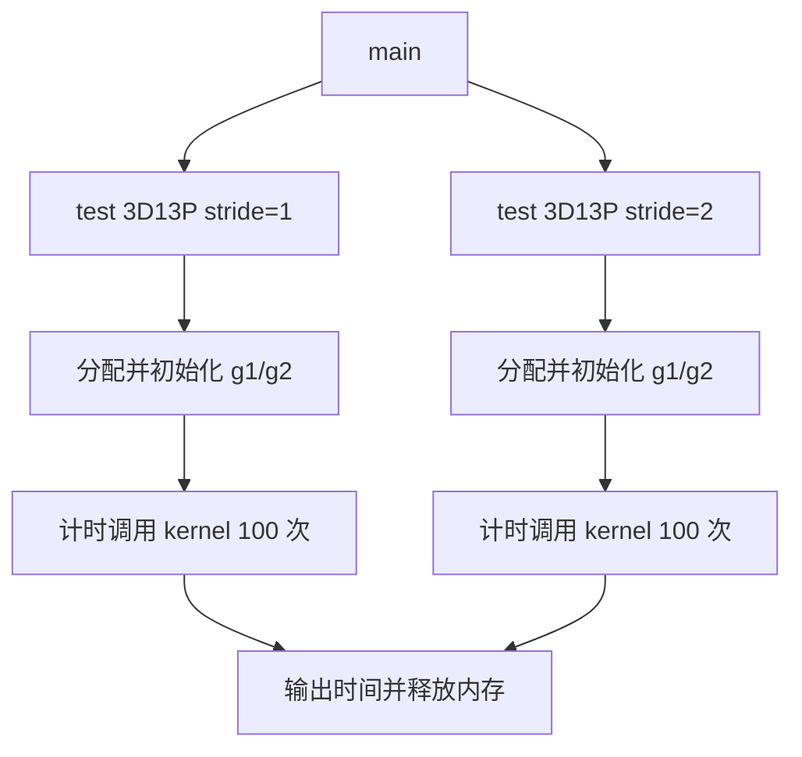
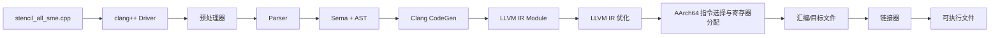
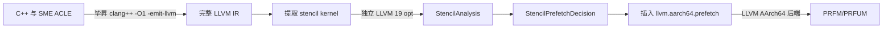

# SME 测试用例执行与编译流程

## 1. 3D13P SME 测试用例执行流程

### 1.1 总体说明执行流程

本目录的 `stencil_all_sme.cpp` 是从服务器抄写的 3D 13-point stencil 测试片段，
由三个部分组成：

1. `main`：选择要执行的测试场景。
2. `test_stencil_3d_13point`：分配数据、初始化输入、计时并重复调用 kernel。
3. `stencil3D_13point_sme`：使用 SVE 加载 13 个邻域向量，通过 SME ZA 完成累加和
   平均值计算。



测试规模固定为 `128 x 512 x 512`。`g1` 和 `g2` 各包含 33,554,432 个
`double`，每个约 256 MiB，合计约 512 MiB。内存分配和输入初始化不在计时范围内；
`Time:` 表示 100 次 kernel sweep 的墙钟总时间，单次平均时间需要除以 100。

100 次调用始终读取 `g1` 并覆盖 `g2`，两个数组不会交换。因此该测试不是 100 个
相互依赖的时间步，而是对同一个输入重复执行相同计算。当前片段也没有 reference
kernel 或结果比较，只能测量运行时间，不能独立验证计算正确性。

kernel 的执行顺序为：

```text
获取 streaming VL
  -> 遍历内部 k/i/j
  -> 生成 j 方向尾部谓词
  -> 加载中心和 12 个邻域向量
  -> 清空 ZA
  -> 执行 13 次 MOPA 累加
  -> 从 ZA 读出结果
  -> 乘以 1/13
  -> 写入 new_grid
```

`stride=2` 只让 `k/i` 跳过平面或行，并让 `j` 跳过一个完整向量块。单次
`svld1_f64` 仍然加载连续元素，不是 lane 内步长为 2 的 gather。

### 1.2 以代码块形式逐语句说明

以下代码块保持原文件的语句和顺序，并用 `//` 注释解释。注释不属于服务器原代码。
其中明显的抄写错误不会直接修正，而是在对应位置标出。

#### 1.2.1 头文件和 Kernel 声明

```cpp
// 引入 SME ZA tile、MOPA 和 ZA 读写相关 ACLE 声明。
#include <arm_sme.h>

// 引入 SVE 向量类型、谓词、加载、存储和向量运算声明。
#include <arm_sve.h>

// 提供 high_resolution_clock 和 duration。
#include <chrono>

// 提供 std::cout 和 std::endl。
#include <iostream>

// 提供 aligned_alloc 和 free。
#include <cstdlib>

// 提供 C 字符串接口；当前片段没有实际使用。
#include <cstring>

// 请求函数进入时使用新的 ZA 状态。
__arm_new("za")

// 声明输入网格、输出网格、三维尺寸和 stride。
// __restrict__ 表示 grid 与 new_grid 不发生别名。
void stencil3D_13point_sme(
    double* __restrict__ grid,
    double* __restrict__ new_grid,
    int depth, int rows, int cols, int stride)

// 声明函数在 SME streaming mode 中运行并开始函数体。
__arm_streaming {
```

#### 1.2.2 Kernel 初始化和循环控制

```cpp
    // 返回当前 streaming vector length 能容纳的 double lane 数。
    // 例如 streaming VL=512 bit 时，SVL=512/64=8。
    uint64_t SVL = svcntd();

    // 一个 k 平面包含 rows*cols 个 double，用于三维下标线性化。
    int plane_size = rows * cols;

    // 创建所有 lane 都为 1/13 的向量，最后用于计算平均值。
    svfloat64_t weight_vec = svdup_f64(1.0 / 13.0);

    // 创建全 1 向量，作为每次 ZA 外积的纵向操作数。
    svfloat64_t ones = svdup_f64(1.0);

    // 创建所有 64-bit lane 都有效的谓词，控制 ZA 纵向维度。
    svbool_t pg_all = svptrue_b64();

    // 从 k=1 开始，避开第 0 个平面和最后一个平面。
    // stride=2 时每次跳过一个平面。
    for (int k = 1; k < depth - 1; k += stride) {

        // 从 i=1 开始，避开第 0 行和最后一行。
        // stride=2 时每次跳过一行。
        for (int i = 1; i < rows - 1; i += stride) {

            // j 沿连续维按向量块前进。
            // stride=2 时跳过一个完整向量块，不是隔元素加载。
            for (int j = 1; j < cols - 1; j += SVL * stride) {

                // 计算当前迭代采用的 j 上界。
                // stride=2 时该范围可大于一个向量，但谓词最多仍有 SVL 个 lane。
                int j_limit = (cols - 1 < j + SVL * stride - 1)
                                  ? cols - 1
                                  : j + SVL * stride - 1;

                // 第 n 个 lane 在 j+n < j_limit+1 时有效。
                // svld1_f64 最多加载 SVL 个连续 double。
                svbool_t pg = svwhilelt_b64(j, j_limit + 1);

                // 若谓词中没有有效 lane，则结束 j 循环。
                // 当前源码写成 svptrue_b64 而不是 svptrue_b64()，需核对 ACLE 写法。
                if (!svptest_any(svptrue_b64, pg))
                    break;

                // 把当前坐标 (k,i,j) 转换为一维数组起始下标。
                int base_idx = k * plane_size + i * cols + j;
```

这里需要注意尾部边界：`j_limit` 最多取 `cols-1`，随后谓词使用
`j_limit+1`，因此可能允许输出列 `cols-1`。对于需要访问 `j+1` 的邻域，最末 lane
还可能跨到下一行。分析预取前应与服务器原代码核对这里是否应限制到 `cols-2`。

#### 1.2.3 加载 13 个输入向量

```cpp
                // (0,0,0)：加载中心向量。
                svfloat64_t center =
                    svld1_f64(pg, &grid[base_idx]);

                // (-1,0,0)：前一个平面的同位置向量。
                svfloat64_t k1_i0_j0 =
                    svld1_f64(pg, &grid[(k - 1) * plane_size + i * cols + j]);

                // (+1,0,0)：后一个平面的同位置向量。
                svfloat64_t kp1_i0_j0 =
                    svld1_f64(pg, &grid[(k + 1) * plane_size + i * cols + j]);

                // (0,-1,0)：当前平面的上一行。
                svfloat64_t k0_i1_j0 =
                    svld1_f64(pg, &grid[k * plane_size + (i - 1) * cols + j]);

                // (0,+1,0)：当前平面的下一行。
                svfloat64_t k0_ip1_j0 =
                    svld1_f64(pg, &grid[k * plane_size + (i + 1) * cols + j]);

                // (0,0,-1)：从中心左侧一个元素开始连续加载。
                svfloat64_t k0_i0_j1 =
                    svld1_f64(pg, &grid[k * plane_size + i * cols + (j - 1)]);

                // (0,0,+1)：从中心右侧一个元素开始连续加载。
                svfloat64_t k0_i0_jp1 =
                    svld1_f64(pg, &grid[k * plane_size + i * cols + (j + 1)]);

                // (-1,-1,0)：前一平面的上一行。
                svfloat64_t k1_i1_j0 = svld1_f64(
                    pg, &grid[(k - 1) * plane_size + (i - 1) * cols + j]);

                // (-1,+1,0)：前一平面的下一行。
                svfloat64_t k1_ip1_j0 = svld1_f64(
                    pg, &grid[(k - 1) * plane_size + (i + 1) * cols + j]);

                // (+1,-1,0)：后一平面的上一行。
                svfloat64_t kp1_i1_j0 = svld1_f64(
                    pg, &grid[(k + 1) * plane_size + (i - 1) * cols + j]);

                // (+1,+1,0)：后一平面的下一行。
                svfloat64_t kp1_ip1_j0 = svld1_f64(
                    pg, &grid[(k + 1) * plane_size + (i + 1) * cols + j]);

                // (-1,0,-1)：前一平面中从 j-1 开始的向量。
                svfloat64_t k1_i0_j1 = svld1_f64(
                    pg, &grid[(k - 1) * plane_size + i * cols + (j - 1)]);

                // (+1,0,+1)：后一平面中从 j+1 开始的向量。
                svfloat64_t kp1_i0_jp1 = svld1_f64(
                    pg, &grid[(k + 1) * plane_size + i * cols + (j + 1)]);
```

`svld1_f64(pg, address)` 的第 `n` 个有效 lane 加载 `address[n]`。逻辑加载量为
`有效 lane 数 x 8 byte`；无效 lane 不访问内存。处理完整向量时，一条加载最多读取
`SVL x 8 byte`，但硬件 cache 传输仍以 cache line 为基本粒度。

#### 1.2.4 ZA 累加、缩放和写回

```cpp
                // 每个输出向量开始前清空 ZA，避免保留上一次 j 迭代的结果。
                svzero_za();

                // 第 1 项：累加中心向量。
                svmopa_za64_f64_m(0, pg_all, pg, ones, center);

                // 第 2 项：累加 (-1,0,0)。
                svmopa_za64_f64_m(0, pg_all, pg, ones, k1_i0_j0);

                // 第 3 项：累加 (+1,0,0)。
                svmopa_za64_f64_m(0, pg_all, pg, ones, kp1_i0_j0);

                // 第 4 项：累加 (0,-1,0)。
                svmopa_za64_f64_m(0, pg_all, pg, ones, k0_i1_j0);

                // 第 5 项：累加 (0,+1,0)。
                svmopa_za64_f64_m(0, pg_all, pg, ones, k0_ip1_j0);

                // 第 6 项：累加 (0,0,-1)。
                svmopa_za64_f64_m(0, pg_all, pg, ones, k0_i0_j1);

                // 第 7 项：累加 (0,0,+1)。
                svmopa_za64_f64_m(0, pg_all, pg, ones, k0_i0_jp1);

                // 第 8 项：累加 (-1,-1,0)。
                svmopa_za64_f64_m(0, pg_all, pg, ones, k1_i1_j0);

                // 第 9 项：累加 (-1,+1,0)。
                svmopa_za64_f64_m(0, pg_all, pg, ones, k1_ip1_j0);

                // 第 10 项：累加 (+1,-1,0)。
                svmopa_za64_f64_m(0, pg_all, pg, ones, kp1_i1_j0);

                // 第 11 项：累加 (+1,+1,0)。
                svmopa_za64_f64_m(0, pg_all, pg, ones, kp1_ip1_j0);

                // 第 12 项：累加 (-1,0,-1)。
                svmopa_za64_f64_m(0, pg_all, pg, ones, k1_i0_j1);

                // 第 13 项：累加 (+1,0,+1)。
                svmopa_za64_f64_m(0, pg_all, pg, ones, kp1_i0_jp1);

                // 从 ZA tile 0 的第 0 行读出逐 lane 累加结果。
                svfloat64_t sum =
                    svread_hor_za64_m(svundef_f64(), pg_all, 0, 0);

                // 有效 lane 乘以 1/13，无效 lane 清零。
                svfloat64_t result = svmul_f64_z(pg, sum, weight_vec);

                // 在 pg 控制下把有效 lane 写回 new_grid[base_idx]。
                svst1_f64(pg, &new_grid[base_idx], result);
            }
        }
    }
}
```

#### 1.2.5 测试函数

```cpp
// run_stride1/run_stride2 分别决定是否执行两个场景。
// 返回值是本次调用实际执行场景的耗时之和。
double test_stencil_3d_13point(bool run_stride1, bool run_stride2) {

    // 输出算子标题，不属于 kernel 计时范围。
    std::cout << std::endl << "------3d13p-----" << std::endl;

    // 固定测试规模为 128x512x512。
    const int DEPTH = 128, ROWS = 512, COLS = 512;

    // 分配约 256 MiB、64-byte 对齐的输入网格。
    double* g1 = (double*)aligned_alloc(
        64, DEPTH * ROWS * COLS * sizeof(double));

    // 分配约 256 MiB、64-byte 对齐的输出网格。
    double* g2 = (double*)aligned_alloc(
        64, DEPTH * ROWS * COLS * sizeof(double));

    // 初始化两个可选场景的累计耗时。
    double total_time = 0.0;

    // 保存单个场景的耗时。
    double elapsed;

    // 只有调用者请求 stride=1 时才执行第一段测试。
    if (run_stride1) {

        // 在计时前初始化 g1[k,i,j] = 1 + linear_index。
        // g2 没有初始化。
        for (int k = 0; k < DEPTH; k++)
            for (int i = 0; i < ROWS; i++)
                for (int j = 0; j < COLS; j++)
                    g1[k * ROWS * COLS + i * COLS + j] =
                        1.0 + (k * ROWS + i) * COLS + j;

        // 标记即将执行 stride=1。
        std::cout << "stride=1..." << std::endl;

        // 记录计时起点。
        auto start = std::chrono::high_resolution_clock::now();

        // 连续调用 100 次；每次读取相同 g1 并覆盖 g2。
        for (int iter = 0; iter < 100; iter++)
            stencil3D_13point_sme(g1, g2, DEPTH, ROWS, COLS, 1);

        // 记录计时终点。
        auto end = std::chrono::high_resolution_clock::now();

        // 计算 100 次调用的墙钟总秒数。
        elapsed = std::chrono::duration<double>(end - start).count();

        // 输出 stride=1 时间。
        std::cout << "Time:" << elapsed << std::endl;

        // 加入测试函数的总时间。
        total_time += elapsed;
    }

    // 只有调用者请求 stride=2 时才执行第二段测试。
    if (run_stride2) {

        // 在 stride=2 计时前重新写入与 stride=1 相同的输入。
        for (int k = 0; k < DEPTH; k++)
            for (int i = 0; i < ROWS; i++)
                for (int j = 0; j < COLS; j++)
                    g1[k * ROWS * COLS + i * COLS + j] =
                        1.0 + (k * ROWS + i) * COLS + j;

        // 标记即将执行 stride=2。
        std::cout << "stride=2..." << std::endl;

        // 记录计时起点。
        auto start = std::chrono::high_resolution_clock::now();

        // 连续调用 100 次 stride=2 kernel。
        for (int iter = 0; iter < 100; iter++)
            stencil3D_13point_sme(g1, g2, DEPTH, ROWS, COLS, 2);

        // 记录计时终点。
        auto end = std::chrono::high_resolution_clock::now();

        // 计算 stride=2 的 100 次调用总秒数。
        elapsed = std::chrono::duration<double>(end - start).count();

        // 输出 stride=2 时间。
        std::cout << "Time:" << elapsed << std::endl;

        // 加入测试函数的总时间。
        total_time += elapsed;
    }

    // 释放输入和输出网格。
    free(g1);
    free(g2);

    // 返回本次函数实际执行场景的耗时之和。
    return total_time;
}
```

当前代码没有检查 `aligned_alloc` 是否失败，也没有初始化或校验输出边界。

#### 1.2.6 `main` 入口

```cpp
// 程序入口保留 argc/argv，但当前片段没有读取命令行参数。
int main(int argc, char* argv[]) {

    // 服务器原程序会根据参数选择 stencil 用例；具体逻辑已被省略。
    // ...根据参数判断执行哪些stencil用例

    // 分配一套网格，只执行 stride=1；返回的耗时没有保存。
    test_stencil_3d_13point(true, false);

    // 再分配一套网格，只执行 stride=2；返回的耗时没有保存。
    test_stencil_3d_13point(false, true);

    // 服务器原程序还会累计并输出总时间；当前片段已省略。
    // ...记录并输出总运行时间

    // 到达 main 末尾等价于 return 0。
}
```

在分析 LLVM IR 或评估预取效果前，仍应核对第 23 行 `svptrue_b64` 是否应为
`svptrue_b64()`，并确认 `j_limit` 是否应将右边界限制到 `cols-2`。否则编译
错误或越界访问可能被误判为 Pass 或预取模型问题。

## 2. 毕昇编译器从 C++ 到 LLVM IR 的过程

### 2.1 毕昇与 LLVM/Clang 的关系

毕昇编译器以 LLVM/Clang 为基础，因此 `clang++` 编译这个 `.cpp` 文件时，主干
流程仍是 Clang Driver 调度 Clang 前端，再由 Clang CodeGen 生成 LLVM IR。毕昇
在此基础上提供面向鲲鹏/AArch64 的目标支持、优化和运行时适配。查阅源码时需要
区分以下两类仓库：

- [openEuler 毕昇编译器仓库](https://gitee.com/openeuler/bisheng-compiler)：毕昇项目源码与说明入口。
- [src-openEuler 毕昇软件包仓库](https://gitee.com/src-openeuler/bisheng-compiler)：发行包的 spec、补丁和构建材料；它不等同于完整 LLVM 源码树。
- [LLVM monorepo](https://github.com/llvm/llvm-project)：Clang 前端、LLVM IR 优化器和 AArch64 后端的上游实现。

毕昇 Enterprise 5.x 的具体补丁和目录可能与上游同版本 LLVM 不完全一致，但下文
描述的前端阶段及主要源码入口是一致的。服务器上应以
`$BISHENG_CXX --version`、`$BISHENG_CXX -print-resource-dir` 和实际发行包源码为准。

### 2.2 总体编译流水线



`clang++` 是编译驱动，不亲自完成所有转换。它分析命令行，确定目标架构、头文件
路径、优化等级和链接选项，然后生成前端、汇编器和链接器任务。可用
`$BISHENG_CXX -### stencil_all_sme.cpp` 只打印这些任务而不执行。

如果命令带 `-S -emit-llvm`，流水线在 LLVM IR 处停止并输出 `.ll`。`.ll` 不是
另一种 IR 层级，而是 LLVM IR 的文本表示；对应的二进制表示是 `.bc`。

### 2.3 各阶段做了什么

| 阶段 | 主要工作 | 输出或观察命令 | 上游源码入口 |
|---|---|---|---|
| Driver | 解析 `-target`、`-march`、`-O1` 等参数，组装编译任务 | `clang++ -###` | [`clang/tools/driver/driver.cpp`](https://github.com/llvm/llvm-project/blob/main/clang/tools/driver/driver.cpp)、[`clang/lib/Driver/Driver.cpp`](https://github.com/llvm/llvm-project/blob/main/clang/lib/Driver/Driver.cpp) |
| 预处理 | 展开 `#include`、宏和条件编译；找到毕昇资源目录中的 `arm_sve.h`、`arm_sme.h` | `clang++ -E` | [`clang/lib/Lex`](https://github.com/llvm/llvm-project/tree/main/clang/lib/Lex) |
| Parser | 将 token 解析为声明、表达式、循环和属性等语法结构 | 与 AST 一起观察 | [`clang/lib/Parse`](https://github.com/llvm/llvm-project/tree/main/clang/lib/Parse) |
| Sema/AST | 类型检查、重载解析、名称绑定，并验证 SME 属性与 ACLE 内建函数是否满足目标特性 | `-Xclang -ast-dump -fsyntax-only` | [`clang/lib/Sema`](https://github.com/llvm/llvm-project/tree/main/clang/lib/Sema)、[Clang AST 说明](https://clang.llvm.org/docs/IntroductionToTheClangAST.html) |
| CodeGen | 遍历 AST，把函数、循环、内存访问和目标内建函数转换为 LLVM IR | `-S -emit-llvm` | [`clang/lib/CodeGen/CodeGenAction.cpp`](https://github.com/llvm/llvm-project/blob/main/clang/lib/CodeGen/CodeGenAction.cpp)、[`CodeGenFunction.cpp`](https://github.com/llvm/llvm-project/blob/main/clang/lib/CodeGen/CodeGenFunction.cpp) |
| IR 优化 | 按 `-O0/-O1/-O2/-O3` 构造 Pass pipeline，执行内联、循环和标量优化等 | `-Rpass` 或 `-mllvm -debug-pass-manager`（是否可用取决于发行版） | [`clang/lib/CodeGen/BackendUtil.cpp`](https://github.com/llvm/llvm-project/blob/main/clang/lib/CodeGen/BackendUtil.cpp)、[`llvm/lib/Passes/PassBuilder.cpp`](https://github.com/llvm/llvm-project/blob/main/llvm/lib/Passes/PassBuilder.cpp) |
| AArch64 后端 | IR 指令选择、合法化、寄存器分配、调度和 MC 编码 | `-S` 生成 `.s`，`-c` 生成 `.o` | [`llvm/lib/Target/AArch64`](https://github.com/llvm/llvm-project/tree/main/llvm/lib/Target/AArch64)、[LLVM Code Generator](https://llvm.org/docs/CodeGenerator.html) |
| 链接 | 合并目标文件和 C/C++、SME ABI 等运行时，生成可执行文件 | 不加 `-S` 或 `-c` | 驱动选择的系统链接器或 LLD |

其中从驱动进入前端的关键调用链可以概括为：

```text
clang++ main
  -> Driver::BuildCompilation
  -> 执行 clang -cc1 前端任务
  -> ExecuteCompilerInvocation
  -> CompilerInstance::ExecuteAction
  -> Parser + Sema 构造 AST
  -> CodeGenAction / CodeGenerator 构造 llvm::Module
  -> EmitBackendOutput 运行 LLVM Pass pipeline 并输出 IR/汇编/目标文件
```

这是便于定位源码的逻辑调用链；不同 LLVM/毕昇版本中的辅助函数和内部调用层次可能
发生变化。

### 2.4 当前 SME kernel 如何转换

#### 2.4.1 头文件与函数属性

`arm_sve.h` 和 `arm_sme.h` 位于编译器资源目录中。它们主要提供 ACLE 类型、属性、
重载入口和内建函数映射，不包含一个像普通 `.cpp` 库那样的循环实现。因此
`svld1_f64`、`svmopa_za64_f64_m` 等调用通常不会编译成对同名外部函数的调用。

`__arm_streaming` 和 `__arm_new("za")` 先作为 Clang 能理解的函数属性进入 AST，
随后转换为 LLVM IR 中的 AArch64/SME 函数属性及状态约束。编译器还会检查
`-march` 是否包含这些操作要求的特性，例如 `sme-f64f64`。

#### 2.4.2 SVE/SME 操作

以 kernel 中的语句为例：

```text
svwhilelt_b64(...)       -> 构造可伸缩向量谓词
svld1_f64(pg, ptr)       -> 带谓词的 SVE 向量加载
svmopa_za64_f64_m(...)   -> SME ZA 外积累加语义
svread_hor_za64_m(...)   -> 从 ZA 水平切片读取向量
svst1_f64(pg, ptr, vec)  -> 带谓词的 SVE 向量存储
```

CodeGen 会把这些目标相关操作降为 `llvm.aarch64.sve.*` 或
`llvm.aarch64.sme.*` 一类 LLVM intrinsic，普通地址计算则表现为 `getelementptr`
（GEP），循环表现为基本块、`phi` 和条件分支。intrinsic 的确切名称和参数随 LLVM
版本变化，应以服务器生成的 `.ll` 为准。

### 2.5 本项目预取 Pass 在流水线中的位置

本项目没有在 C++ AST 或 Clang CodeGen 中插入预取，而是在已经生成的 LLVM IR
上运行独立的 new-PM 插件：



具体对应关系如下：

1. `01_llvm_ir_analysis/generate_and_check.sh` 调用毕昇 `clang++`，使用
   `-O1 -fno-inline -S -emit-llvm` 生成完整 `.ll`，再从包含 `test` 和 `main` 的
   Module 中提取 stencil kernel。
2. `02_llvm_pass_plugin/build_and_test.sh` 使用独立 LLVM 19 构建并加载
   `StencilPrefetchPass`。
3. `StencilAnalysis` 从 GEP、load、循环、SCEV 和可伸缩向量步长中恢复数据流；
   `StencilPrefetchDecision` 立即作出距离、层级和 KEEP/STRM 决策。
4. 同一个 Pass 在循环中插入 `llvm.aarch64.prefetch`，然后 `verify` 检查 IR。
5. AArch64 后端把 intrinsic 选择为目标预取指令。当前脚本还会核对 IR 中 intrinsic
   数量与汇编中的 `PRFM`/`PRFUM` 数量。

因此我们的 Pass 位于 **Clang 前端和初始 `-O1` IR 优化之后、AArch64 指令选择
之前**。它能看到规范化后的 SSA、GEP、循环和 SCEV，但已经失去一部分 C++ 层的
数组形状、源码变量名和 stencil 邻域表达式语义，这也是当前分析必须从 IR 拓扑
恢复物理流的原因。

### 2.6 在服务器观察每一步

以下命令只观察编译过程，不需要修改源码。`BISHENG_CXX` 应指向能直接编译原 SME
程序的毕昇 `clang++`：

```bash
# 1. 查看版本、资源头文件目录和 Driver 将执行的子任务。
"$BISHENG_CXX" --version
"$BISHENG_CXX" -print-resource-dir
"$BISHENG_CXX" -### -march=armv9-a+sme+sme-f64f64 stencil_all_sme.cpp

# 2. 查看预处理结果。
"$BISHENG_CXX" -E -march=armv9-a+sme+sme-f64f64 \
  stencil_all_sme.cpp -o stencil_all_sme.ii

# 3. 查看 Clang AST；输出很大，重定向到文件。
"$BISHENG_CXX" -march=armv9-a+sme+sme-f64f64 -fsyntax-only \
  -Xclang -ast-dump stencil_all_sme.cpp > stencil_all_sme.ast.txt

# 4. 生成 LLVM IR。项目步骤 1 使用 -O1 和 -fno-inline。
"$BISHENG_CXX" -O1 -fno-inline -S -emit-llvm \
  -march=armv9-a+sme+sme-f64f64 stencil_all_sme.cpp -o stencil_all_sme.ll

# 5. 不经过汇编和链接，直接查看 AArch64 汇编。
"$BISHENG_CXX" -O1 -S -march=armv9-a+sme+sme-f64f64 \
  stencil_all_sme.cpp -o stencil_all_sme.s
```

本项目的真实服务器流程不能简单地把所有步骤都换成独立 LLVM 的 `clang++`：原始
C++ 应先由毕昇前端处理 SME ACLE 与 ABI；独立 LLVM 19 负责读取兼容的 LLVM IR、
运行自定义 `opt` Pass。生成最终可执行文件时仍需使用能正确提供毕昇 SME ABI
运行时和链接参数的毕昇驱动。
